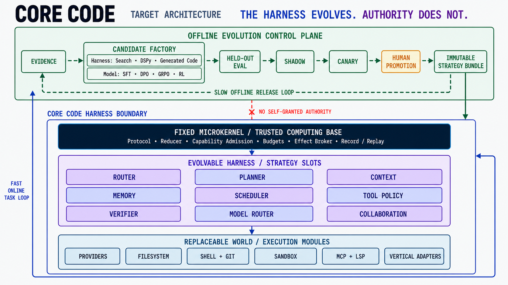

<h1 align="center">
  
</h1>

<p align="center">
  <strong>An open-source coding agent for the terminal, built on a modular Rust runtime.</strong>
  <br>
  Bounded execution, durable evidence, observable work, and deny-by-default authority.
</p>

<p align="center">
  <a href="https://github.com/Plantcore-AI/Iteron/actions/workflows/ci.yml"></a>
  <a href="https://github.com/Plantcore-AI/Iteron/actions/workflows/docs.yml"></a>
  <a href="https://github.com/Plantcore-AI/Iteron/releases"></a>
  <a href="https://www.rust-lang.org/"></a>
  <a href="LICENSE"></a>
</p>

<p align="center">
  <a href="https://plantcore-ai.github.io/Iteron/">Documentation</a>
  · <a href="#install">Install</a>
  · <a href="#quickstart">Quickstart</a>
  · <a href="docs/architecture.md">Architecture</a>
  · <a href="docs/roadmap.md">Roadmap</a>
  · <a href="CONTRIBUTING.md">Contributing</a>
</p>

> [!WARNING]
> **Public pre-alpha, and unconfined by default.** Iteron is ready for
> development and evaluation, not unattended use on sensitive repositories.
> Interfaces may change before the first compatibility-stable release.
>
> Since 2026-08-05 the shipped default is the operator's own authority, and it is
> ungated: every tool auto-approves without prompting, `bash` reaches the network
> and the whole filesystem, and the file tools address any path the operator's
> account can. Since 2026-08-06 that authority is also carried by delegated
> sub-agents, and a turn that has read untrusted content may still reach the
> network — the trust-egress conjunct does not apply to an operator-authority
> session. `--ask-permissions` restores the capability gate and the conjunct,
> `--confine` puts executed code back inside the Seatbelt/bubblewrap sandbox. Run
> an untrusted repository with both, or with `--mode plan`, or not at all.

Iteron combines a focused coding-agent experience with a reusable agent
runtime substrate. The `iteron` command provides a full-screen TUI and bounded
one-shot automation. Underneath it, small Rust crates separate protocol,
authority, provider routing, context, tools, sandboxing, durable records,
observability, evaluation, and future evolution strategies.

## Install

Iteron does not currently publish an accepted binary release. Build the
current source with Rust 1.90 or newer:

```sh
git clone https://github.com/Plantcore-AI/Iteron.git
cd core
cargo install --locked --path crates/cli
iteron --version
```

The repository includes an installer and native release pipeline, but neither
is a currently available binary installation path. A binary release will be
accepted only after every required platform has native build, test, packaging,
and smoke-test evidence and the corresponding public assets exist. See the
[installation guide](docs/getting-started/installation.md) for the proposed
target matrix and verification contract.

## Quickstart

Iteron defaults to the GLM provider and the source-versioned GLM 5.2 catalog
default. Make `GLM_API_KEY` available through your shell or secret manager, then
open a repository:

```sh
cd /path/to/repository
core
```

Inside the TUI:

- describe the outcome you want in the composer;
- use `/model` to inspect selectable providers and account-visible models;
- `/permissions` shows the gate state; on a default run it opens with a
  `BYPASSED` notice, because nothing below it is deciding anything;
- use `/help` for the complete command registry.

A missing credential leaves the provider and its models visibly unavailable.
Model discovery does not pretend to know account funding, quota, or entitlement.

For bounded one-shot work:

```sh
core -p -C /path/to/repository \
  --max-turns 24 \
  "Explain the failing test and propose the smallest correct fix"
```

Code execution is enabled by default and runs with your own user authority. Keep
completion behind a harness-owned verification gate, and add `--confine` when the
repository is not yours:

```sh
core -p -C /path/to/repository \
  --verify 'cargo test --workspace --all-targets --locked' \
  "Fix the failing test, verify the change, and summarize the evidence"
```

```sh
# The same run, with executed code back inside the sandbox: no network, writes
# confined to the workspace, ambient credential paths denied.
core -p -C /path/to/untrusted-repository --confine \
  "Explain what this repository's build script does"
```

Continue with the [five-minute quickstart](docs/getting-started/quickstart.md),
[provider setup](docs/getting-started/providers.md), and
[permissions and sandbox guide](docs/using/permissions-and-sandbox.md).

## Why Iteron

| | Contract |
| --- | --- |
| **Terminal-native product** | Full-screen transcript, composer, tools, permissions, model/effort controls, session history, and machine-readable one-shot output. |
| **Bounded runtime** | Explicit ceilings for turns, time, cost, retries, queues, output, and concurrency; no unbounded “autonomous” mode. |
| **Authority separation** | Learned strategies may propose actions. They cannot grant capabilities, rewrite evidence, relax hard budgets, or promote themselves. |
| **Durable evidence** | Hash-chained session records, checkpoints, resume/fork contracts, correlated tool events, and provider-grounded usage/cost states. |
| **Provider truth** | Documented catalogs, credential-visible discovery, capability mapping, and disabled/unknown states remain distinct. |
| **Modular ownership** | Machine-validated Rust dependency boundaries and human responsibility units let maintainers work independently without inventing agent governance authority. |

## What ships today

- Interactive TUI plus text, JSON, and stream-JSON one-shot interfaces.
- Anthropic Messages, OpenAI Responses, and OpenAI-compatible chat transports.
- Built-in profiles for Anthropic, OpenAI, DeepSeek, GLM, MiniMax, and Fireworks,
  plus bounded operator-defined OpenAI-compatible routes.
- Repository read, search, edit, shell, Git, web, memory, skills, hooks, MCP, and
  verification primitives with typed capabilities.
- Typed permission rules behind `--ask-permissions`, macOS Seatbelt and Linux
  bubblewrap backends behind `--confine`, and a kernel admission layer that
  neither flag can widen.
- Hash-chained local sessions with resume, continue, fork, checkpoint, and
  replay-oriented contracts.
- Replaceable context, decomposition, verification, evaluation, observability,
  and future evolution seams that do not receive kernel authority.

## Architecture

Iteron is a modular Rust workspace today. The runtime is still a modular
monolith; it does **not** claim complete microkernel conformance yet.

<p align="center">
  
</p>

<p align="center">
  <em>Target architecture — the current runtime is a modular monolith, and live
  self-evolution is not shipped.</em>
</p>

The long-term unit of evolution is the harness, not only model weights. Typed
strategy slots and replaceable world modules may receive versioned candidates
from search, DSPy, generated code, SFT, DPO, GRPO, RL, or later methods. The
microkernel's authority, budgets, effect mediation, evidence integrity, and
human promotion boundary do not self-modify.

| Plane | Current crates | Responsibility |
| --- | --- | --- |
| Authority | `protocol`, `kernel`, `sched` | Events, capabilities, effects, budgets, retries, and lifecycle |
| Intelligence | `provider`, `ctx`, `agents`, `verify` | Models, context, decomposition, synthesis, and evidence selection |
| Execution | `tools`, `sandbox`, `mcp` | Bounded workspace effects and external-tool integration |
| Evidence | `record`, `obs`, `eval` | Durable records, usage/cost truth, and evaluation ground truth |
| Evolution | `evolve` | Non-authoritative strategy candidates and promotion contracts |
| Product | `cli` | TUI, one-shot CLI, configuration, routing, and output surfaces |

Every mechanism is judged against five invariants:

1. **Bounded** — work and resource use have explicit ceilings.
2. **Recoverable** — interruption and crash have defined durable outcomes.
3. **Reproducible** — replay does not silently re-derive nondeterministic output.
4. **Observable** — phase, usage, effects, verification, and strategy attribution
   are represented as evidence.
5. **Security-bounded** — authority is deny-by-default and its blast radius is
   explicit.

Read the [architecture](docs/architecture.md),
[evolution boundary](docs/concepts/evolution-boundary.md),
[runtime lifecycle](docs/concepts/runtime-lifecycle.md), and generated
[ownership map](OWNERSHIP.md) for the current contracts.

## Status and roadmap

| Delivered development baseline | Not yet accepted |
| --- | --- |
| TUI and one-shot CLI | Stable CLI/config/record compatibility |
| Six provider profiles and three wire adapters | Complete provider and production conformance |
| Typed tools, permissions, hooks, skills, and initial MCP client | Complete MCP/LSP/plugin and persistent PTY lifecycle |
| macOS/Linux sandbox backends with live CI tests, selected by `--confine` | A default-on sandbox, VM-grade isolation, or confidentiality guarantees |
| Durable session, resume, fork, and checkpoint primitives | Full pure-reducer App Server runtime and crash reconciliation |
| Evaluation and evolution boundary crates | Production evaluation corpus or live self-evolution |

The [roadmap](docs/roadmap.md) uses integration evidence rather than dates or
feature counts. It deliberately separates delivered foundations from unaccepted
milestones. Iteron does not claim parity with Codex, Claude Code, or another
production coding agent.

## Documentation

The complete documentation lives at
**[plantcore-ai.github.io/Iteron](https://plantcore-ai.github.io/Iteron/)**.

| Start | Use | Build and govern |
| --- | --- | --- |
| [Installation](docs/getting-started/installation.md) | [Terminal UI](docs/using/tui.md) | [Architecture](docs/architecture.md) |
| [Quickstart](docs/getting-started/quickstart.md) | [Models and providers](docs/using/models-and-providers.md) | [Contributor guide](CONTRIBUTING.md) |
| [Provider setup](docs/getting-started/providers.md) | [Sessions](docs/using/sessions.md) | [Governance](GOVERNANCE.md) |
| [First session](docs/getting-started/first-session.md) | [CLI reference](docs/reference/cli.md) | [Roadmap](docs/roadmap.md) |
| [Troubleshooting](docs/reference/troubleshooting.md) | [Permissions and sandbox](docs/using/permissions-and-sandbox.md) | [Security](SECURITY.md) |

## Contributing

Focused bug fixes, tests, documentation, provider adapters, evaluation fixtures,
and carefully scoped features are welcome. Start with
[CONTRIBUTING.md](CONTRIBUTING.md), follow the
[Code of Conduct](CODE_OF_CONDUCT.md), and browse
[good first issues](https://github.com/Plantcore-AI/Iteron/labels/good%20first%20issue).
Questions and design discussions belong in
[GitHub Discussions](https://github.com/Plantcore-AI/Iteron/discussions).

Iteron uses human-owned module and invariant boundaries rather than a fixed
maintainer count. Contributors do not need a maintainership title, and coding
agents never hold review, merge, release, or governance authority.

## Governance and leadership

<table>
  <tr>
    <td width="92" align="center">
      <a href="https://github.com/fr0m-scratch"></a>
    </td>
    <td>
      <strong><a href="https://github.com/fr0m-scratch">Jamal Cao</a></strong><br>
      <code>@fr0m-scratch</code> · Creator and Project Lead<br>
      Final project direction and override authority remain human-owned and
      auditable through the public governance contract.
    </td>
  </tr>
</table>

Maintainer count is intentionally not fixed. Humans claim coherent module or
invariant boundaries, accept ongoing responsibility, and use protected review
paths. See [GOVERNANCE.md](GOVERNANCE.md) and
[OWNERSHIP.md](OWNERSHIP.md).

## Security

Do not report a suspected vulnerability in a public issue. Use GitHub's private
**Report a vulnerability** flow described in [SECURITY.md](SECURITY.md). Never
include credentials, customer data, private session records, or weaponized
exploit material in public channels.

## License

Iteron is licensed under the [Apache License, Version 2.0](LICENSE). Unless a
contributor explicitly states otherwise, intentionally submitted contributions
are licensed under the same terms as described in Section 5 of the license. No
CLA is required.
