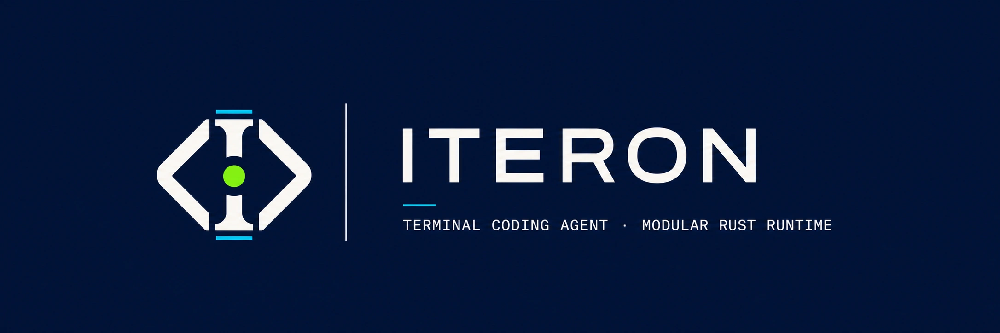

<p align="center">
  
</p>

<p align="center">
  <strong>An Apache-2.0 coding agent for the terminal.</strong><br>
  Bounded execution, durable evidence, observable work, and explicit authority.
</p>

<p align="center">
  <a href="https://github.com/Plantcore-AI/Iteron/actions/workflows/ci.yml"></a>
  <a href="https://github.com/Plantcore-AI/Iteron/actions/workflows/docs.yml"></a>
  <a href="https://github.com/Plantcore-AI/Iteron/releases"></a>
  <a href="https://www.rust-lang.org/"></a>
  <a href="LICENSE"></a>
</p>

<p align="center">
  <a href="https://plantcore-ai.github.io/Iteron/">Documentation</a>
  · <a href="#install">Install</a>
  · <a href="#quickstart">Quickstart</a>
  · <a href="docs/getting-started/setup-and-byok.md">BYOK</a>
  · <a href="docs/architecture.md">Architecture</a>
  · <a href="CONTRIBUTING.md">Contributing</a>
</p>

> [!WARNING]
> **Pre-alpha; code execution is unconfined by default.** Iteron is intended for
> development and evaluation, not unattended use on sensitive repositories.
> Use `--ask-permissions` to restore the capability gate and `--confine` to put
> executed code inside the macOS Seatbelt or Linux bubblewrap sandbox.

Iteron combines a focused full-screen coding experience with a modular Rust
runtime. It supports interactive work, bounded one-shot automation, explicit
permissions, provider routing, durable sessions, verification, and
machine-readable output.

## Install

```sh
curl --proto '=https' --tlsv1.2 -LsSf https://github.com/Plantcore-AI/Iteron/releases/latest/download/install.sh | sh
```

The installer verifies the selected release archive, installs without `sudo`,
and does not edit shell profiles. Release targets are macOS arm64, Linux arm64,
and Linux x86-64. See the [installation and verification
guide](docs/getting-started/installation.md) for version pinning, checksums,
attestations, and source builds.

## Quickstart

Validate and store a provider credential outside the repository:

```sh
iteron setup --byok glm
```

Then open a repository:

```sh
cd /path/to/repository
iteron
```

Inside the TUI, describe the outcome you want. Use `/model` to choose an
account-visible model, `/permissions` to inspect authority, and `/help` for the
command registry. A missing credential leaves that provider unavailable rather
than pretending the route works.

For bounded one-shot work:

```sh
iteron -p -C /path/to/repository \
  --max-turns 24 \
  --verify 'cargo test --workspace --all-targets --locked' \
  "Fix the failing test, verify the change, and summarize the evidence"
```

Use both safety controls for an untrusted repository:

```sh
iteron -p -C /path/to/untrusted-repository --ask-permissions --confine \
  "Explain what this repository's build script does"
```

Continue with the [five-minute quickstart](docs/getting-started/quickstart.md),
[Setup and BYOK](docs/getting-started/setup-and-byok.md), and the
[permissions and sandbox guide](docs/using/permissions-and-sandbox.md).

## Why Iteron

| Principle | Contract |
| --- | --- |
| **Terminal native** | Full-screen TUI plus text, JSON, and stream-JSON automation. |
| **Bounded runtime** | Explicit ceilings for turns, time, cost, retries, queues, output, and concurrency. |
| **Authority separation** | Strategies may propose work; they cannot grant capabilities, relax hard budgets, or rewrite evidence. |
| **Durable evidence** | Hash-chained sessions, checkpoints, correlated tool events, and provider-grounded usage states. |
| **Provider truth** | Credential-visible discovery and explicit available, disabled, or unknown capability states. |
| **Modular ownership** | Machine-validated Rust boundaries with accountable human maintainers and protected review. |

## What ships today

- Interactive TUI and bounded one-shot interfaces.
- Anthropic Messages, OpenAI Responses, and OpenAI-compatible Chat adapters.
- Built-in profiles for Anthropic, OpenAI, DeepSeek, GLM, MiniMax, and
  Fireworks, plus operator-defined compatible routes.
- Workspace read, search, edit, shell, Git, web, memory, skills, hooks, MCP, and
  verification primitives with typed capabilities.
- Permission rules behind `--ask-permissions`; macOS Seatbelt and Linux
  bubblewrap backends behind `--confine`.
- Hash-chained local sessions with resume, continue, fork, checkpoint, and
  replay-oriented contracts.

Iteron remains a modular monolith; it does not claim complete microkernel
conformance, production readiness, confidentiality isolation, or live
self-evolution. The [architecture](docs/architecture.md), [project
status](docs/project/status.md), and [roadmap](docs/roadmap.md) distinguish
shipped behavior from target contracts.

## Documentation

| Start | Use | Build and govern |
| --- | --- | --- |
| [Installation](docs/getting-started/installation.md) | [Terminal UI](docs/using/tui.md) | [Architecture](docs/architecture.md) |
| [Quickstart](docs/getting-started/quickstart.md) | [Models and providers](docs/using/models-and-providers.md) | [Contributor guide](CONTRIBUTING.md) |
| [Setup and BYOK](docs/getting-started/setup-and-byok.md) | [Sessions](docs/using/sessions.md) | [Governance](GOVERNANCE.md) |
| [Troubleshooting](docs/reference/troubleshooting.md) | [Permissions and sandbox](docs/using/permissions-and-sandbox.md) | [Security](SECURITY.md) |

## Contributing

Bug fixes, tests, documentation, provider adapters, evaluation fixtures, and
carefully scoped features are welcome. Read [CONTRIBUTING.md](CONTRIBUTING.md),
follow the [Code of Conduct](CODE_OF_CONDUCT.md), and browse the
[good first issues](https://github.com/Plantcore-AI/Iteron/labels/good%20first%20issue).

Iteron is created and led by [Jamal Cao
(@fr0m-scratch)](https://github.com/fr0m-scratch). Project decisions, reviews,
merges, releases, and governance authority remain human-owned. See
[GOVERNANCE.md](GOVERNANCE.md) and [OWNERSHIP.md](OWNERSHIP.md).

## Security

Do not report vulnerabilities in public issues. Use GitHub's private **Report a
vulnerability** flow described in [SECURITY.md](SECURITY.md). Never include
credentials, customer data, private session records, or weaponized exploit
material in public channels.

## License

Iteron is licensed under the [Apache License, Version 2.0](LICENSE). No CLA is
required.
