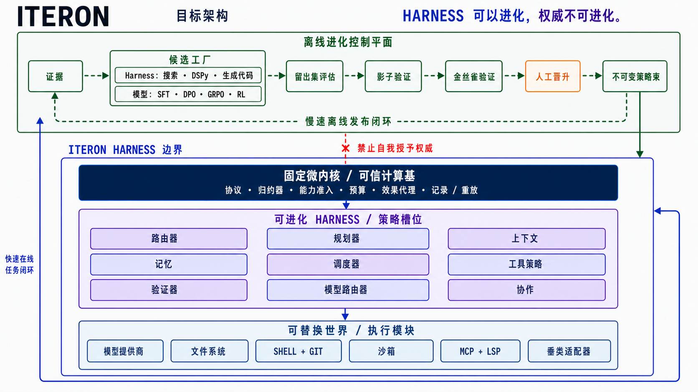

<h1 align="center">
  
</h1>

<p align="center">
  <strong>面向终端的 Apache-2.0 编码智能体。</strong><br>
  有界执行、持久证据、可观测工作与明确权限。
</p>

<p align="center">
  <a href="README.md"><strong>English</strong></a> · <strong>简体中文</strong>
</p>

<p align="center">
  <a href="https://github.com/Plantcore-AI/Iteron/actions/workflows/ci.yml"></a>
  <a href="https://github.com/Plantcore-AI/Iteron/actions/workflows/docs.yml"></a>
  <a href="https://github.com/Plantcore-AI/Iteron/releases"></a>
  <a href="https://www.rust-lang.org/"></a>
  <a href="LICENSE"></a>
</p>

<p align="center">
  <a href="https://plantcore-ai.github.io/Iteron/">完整文档</a>
  · <a href="#安装">安装</a>
  · <a href="#快速开始">快速开始</a>
  · <a href="docs/getting-started/setup-and-byok.md">BYOK 设置</a>
  · <a href="#架构">架构</a>
  · <a href="CONTRIBUTING.md">参与贡献</a>
</p>

> [!WARNING]
> **项目仍处于预发布阶段；代码执行默认不受沙箱约束。** Iteron 适合开发与评估，
> 不应在敏感仓库中无人值守运行。使用 `--ask-permissions` 恢复能力审批，使用
> `--confine` 将执行的代码放入 macOS Seatbelt 或 Linux bubblewrap 沙箱。

Iteron 将专注的全屏编码体验构建在模块化 Rust 运行时之上，支持交互式工作、
有界单次自动化、显式权限、模型提供商路由、持久会话、验证以及机器可读输出。
当前工作区版本为 **v0.0.7**。

## 安装

```sh
curl --proto '=https' --tlsv1.2 -LsSf https://github.com/Plantcore-AI/Iteron/releases/latest/download/install.sh | sh
```

安装器会校验所选版本的归档文件，无需 `sudo`，也不会修改 shell 启动文件。
发布目标包括 macOS arm64、Linux arm64 与 Linux x86-64。版本固定、校验和、
证明材料与源码构建方式见[安装与验证指南](docs/getting-started/installation.md)。

无需提供商凭据即可检查命令是否进入当前 shell 的搜索路径：

```sh
command -v iteron
iteron --version
```

若第一条命令没有输出，请把安装目录（通常为 `$HOME/.local/bin`）加入 `PATH`，
然后重新打开 shell。

## 快速开始

先验证并保存一个由你控制的模型提供商凭证；凭证保存在仓库之外：

```sh
iteron setup --byok glm
```

然后打开一个仓库：

```sh
cd /path/to/repository
iteron
```

在 TUI 中描述你希望得到的结果。使用 `/model` 选择当前账户可见的模型，
使用 `/permissions` 检查权限，使用 `/help` 查看命令注册表。凭证缺失时，
对应提供商会明确显示为不可用，而不会伪装成可工作的路由。

进行有界单次工作：

```sh
iteron -p -C /path/to/repository \
  --max-turns 24 \
  --verify 'cargo test --workspace --all-targets --locked' \
  "修复失败的测试，验证改动，并总结证据"
```

处理不受信任的仓库时，同时启用两项安全控制：

```sh
iteron -p -C /path/to/untrusted-repository --ask-permissions --confine \
  "解释这个仓库的构建脚本会执行什么"
```

继续阅读[五分钟快速开始](docs/getting-started/quickstart.md)、
[设置与 BYOK](docs/getting-started/setup-and-byok.md)以及
[权限与沙箱指南](docs/using/permissions-and-sandbox.md)。
如需在不读取或暴露凭据值的情况下检查 provider 设置，请参阅
[无凭据 Provider 诊断](docs/getting-started/provider-diagnosis.zh-CN.md)。

## BYOK 设置

Iteron 不附带模型用量。请使用你自己控制的提供商账户，费用由该提供商直接
向该账户结算。`iteron setup --byok PROVIDER` 会在保存凭证前完成一次最小化真实
请求验证，并将凭证以 `0600` 权限写入 `~/.iteron/credentials/`，不会把密钥写入
仓库或 `config.json`。

常用命令：

```sh
iteron setup --byok glm        # GLM / 智谱，默认提供商
iteron setup --byok anthropic
iteron setup --byok openai
iteron setup --byok deepseek
iteron setup --byok minimax
iteron setup --byok fireworks
iteron auth status glm         # 仅报告本地、无凭证值的状态
iteron config get provider
```

完整的优先级、轮换、注销和自定义端点说明见
[设置与 BYOK](docs/getting-started/setup-and-byok.md)及
[模型与提供商](docs/using/models-and-providers.md)。

## 为什么选择 Iteron

| 原则 | 契约 |
| --- | --- |
| **终端原生** | 全屏 TUI，以及文本、JSON、stream-JSON 自动化接口。 |
| **有界运行时** | 对轮次、时间、成本、重试、队列、输出和并发设置明确上限。 |
| **权限分离** | 策略可以提出工作，但不能授予能力、放宽硬预算或改写证据。 |
| **持久证据** | 哈希链会话、检查点、关联工具事件与由提供商依据支撑的用量状态。 |
| **提供商真值** | 基于凭证可见性的发现，以及可用、禁用或未知能力的显式状态。 |
| **模块化所有权** | 由机器校验的 Rust 边界、可问责的人类维护者与受保护的评审。 |

## 架构

目标边界把权限冻结在一个小型可信计算基中，同时让策略槽位和执行模块保持
可替换。离线候选只有通过留出评估、影子运行、金丝雀和显式人工晋升，才能
进入运行时。当前实现边界和拆分路径见[架构指南](docs/architecture.md)。

Iteron **只优化 harness 制品**。Base-model 权重与 adapter 均被冻结；manifest 中
为兼容历史协议而保留的 model-weight 形态会被拒绝。SFT、preference、GRPO 与 RL
名称只描述 harness candidate producer 的来源，不授权模型训练，也不允许把 trajectory
导出用于模型训练。



## 当前已交付

- 交互式 TUI 和有界单次执行接口。
- Anthropic Messages、OpenAI Responses 与 OpenAI 兼容 Chat 适配器。
- Anthropic、OpenAI、DeepSeek、GLM、MiniMax 和 Fireworks 内置配置，
  以及由操作者定义的兼容路由。
- 工作区读取、搜索、编辑、shell、Git、Web、记忆、技能、钩子、MCP 和验证原语，
  并由类型化能力约束。
- `--ask-permissions` 后的权限规则，以及 `--confine` 后的 macOS Seatbelt 与
  Linux bubblewrap 后端。
- 带恢复、继续、分叉、检查点和面向回放契约的哈希链本地会话。

Iteron 当前仍是模块化单体；项目不声称已实现完整微内核一致性、生产就绪、
机密性隔离、在线自我演化或 benchmark 性能提升。
[证据约束的 claim sheet](docs/reference/claim-sheet.md)、
[Harness Checkpoints 论文草稿](docs/reference/harness-checkpoints-paper.md)、
[架构](docs/architecture.md)、[项目状态](docs/project/status.md)和
[路线图](docs/roadmap.md)明确区分已交付行为与目标契约。

## 文档

| 开始 | 使用 | 构建与治理 |
| --- | --- | --- |
| [安装](docs/getting-started/installation.md) | [终端界面](docs/using/tui.md) | [架构](docs/architecture.md) |
| [快速开始](docs/getting-started/quickstart.md) | [模型与提供商](docs/using/models-and-providers.md) | [贡献指南](CONTRIBUTING.md) |
| [设置与 BYOK](docs/getting-started/setup-and-byok.md) | [会话](docs/using/sessions.md) | [治理](GOVERNANCE.md) |
| [故障排查](docs/reference/troubleshooting.md) | [权限与沙箱](docs/using/permissions-and-sandbox.md) | [安全](SECURITY.md) |

## 参与贡献

欢迎提交聚焦的缺陷修复、测试、文档、提供商适配器与评估 fixture。请先阅读
[贡献指南](CONTRIBUTING.md)和[行为准则](CODE_OF_CONDUCT.md)，也可以浏览
[适合首次贡献的问题](https://github.com/Plantcore-AI/Iteron/labels/good%20first%20issue)。

## 治理与项目负责人

<table>
  <tr>
    <td width="92" align="center">
      <a href="https://github.com/fr0m-scratch"></a>
    </td>
    <td>
      <strong><a href="https://github.com/fr0m-scratch">Jamal Cao</a></strong><br>
      <code>@fr0m-scratch</code> · 创建者与项目负责人<br>
      项目的最终方向和否决权由人类持有，并可通过公开治理契约审计。
    </td>
  </tr>
</table>

维护者人数不预先固定。人类维护者认领边界清晰的模块或不变量，承担持续责任，
并使用受保护的评审路径。详见[治理](GOVERNANCE.md)与
[所有权边界](OWNERSHIP.md)。

## 安全

请勿在公开 issue 中报告漏洞。请使用 [SECURITY.md](SECURITY.md) 所述的 GitHub
私密 **Report a vulnerability** 流程。公开渠道中绝不能包含凭证、客户数据、
私密会话记录或可直接武器化的利用材料。

## 许可证与商标

Iteron 采用 [Apache License, Version 2.0](LICENSE) 许可，不要求签署 CLA。
依照 Apache-2.0 第 6 节，本许可证不授予许可方商号、商标、服务标志或产品名称的
使用权，但为合理、惯常地说明作品来源或复制 NOTICE 内容所必需的使用除外。
