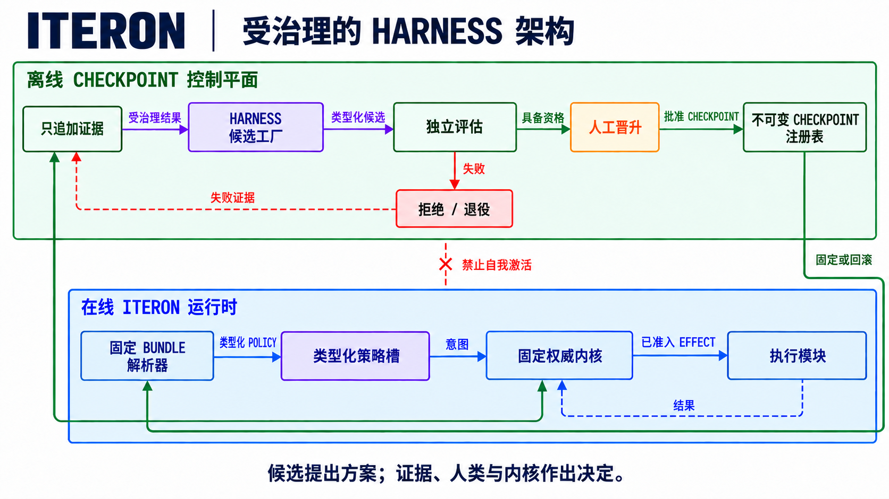

<h1 align="center">
  
</h1>

<p align="center">
  <strong>面向任意垂类 Agent 的 Harness Checkpoint 开源 substrate。</strong><br>
  围绕每一组模型 × 任务构建、评估并治理对应的 harness。
</p>

<p align="center">
  <a href="README.md"><strong>English</strong></a> · <strong>简体中文</strong>
</p>

<p align="center">
  <a href="https://github.com/Plantcore-AI/Iteron/actions/workflows/ci.yml"></a>
  <a href="https://github.com/Plantcore-AI/Iteron/actions/workflows/docs.yml"></a>
  <a href="https://github.com/Plantcore-AI/Iteron/releases"></a>
  <a href="https://www.rust-lang.org/"></a>
  <a href="LICENSE"></a>
</p>

<p align="center">
  <a href="https://plantcore-ai.github.io/Iteron/">完整文档</a>
  · <a href="#安装">安装</a>
  · <a href="#快速开始">快速开始</a>
  · <a href="#为什么选择-iteron">为什么选择 Iteron</a>
  · <a href="docs/architecture.md">架构</a>
  · <a href="CONTRIBUTING.md">参与贡献</a>
</p>

> [!WARNING]
> **项目仍处于预发布阶段；代码执行默认不受沙箱约束。** Iteron 适用于开发与
> 评估，不应在敏感仓库中无人值守运行。使用 `--ask-permissions` 恢复能力审批，
> 使用 `--confine` 启用 macOS Seatbelt 或 Linux bubblewrap。Windows 没有代码
> 执行沙箱，因此 `--confine` 会拒绝命令执行。

Iteron 是用于构建、评估和治理**任意垂类 AI Agent Harness Checkpoint** 的开源
substrate。它提供覆盖上下文、工具、策略、权限、证据与 checkpoint 生命周期的
模块化 Rust 运行时契约。终端编码智能体是第一个参考实现，支持交互式工作、有界
自动化、提供商路由、持久会话、验证和机器可读输出。当前工作区与最新公开版本均为
**v0.0.20**。

## 安装

macOS 与 Linux：

```sh
curl --proto '=https' --tlsv1.2 -LsSf https://github.com/Plantcore-AI/Iteron/releases/latest/download/install.sh | sh
```

Windows PowerShell：

```powershell
[Net.ServicePointManager]::SecurityProtocol = [Net.ServicePointManager]::SecurityProtocol -bor [Net.SecurityProtocolType]::Tls12; Invoke-RestMethod -Uri 'https://github.com/Plantcore-AI/Iteron/releases/latest/download/install.ps1' | Invoke-Expression
```

v0.0.20 发布 macOS arm64、Linux arm64、Linux x86-64 与 Windows x86-64
二进制。安装器会校验所选归档，并以当前用户身份安装，无需提权。Windows 获得
分发包并不改变其没有代码执行沙箱的边界。版本固定、校验和、证明材料和源码构建
说明见[安装与验证指南](docs/getting-started/installation.md)。

无需提供商凭据即可检查 shell 是否解析到正确命令：

```sh
command -v iteron
iteron --version
```

## 快速开始

先验证并把提供商凭据保存到仓库之外：

```sh
iteron setup --byok glm
```

打开一个仓库并启动全屏界面：

```sh
cd /path/to/repository
iteron
```

进入 TUI 后直接描述期望结果。使用 `/model` 选择账号可见的模型，使用
`/permissions` 检查权限，使用 `/help` 查看命令列表。

进行有界单次工作：

```sh
iteron -p -C /path/to/repository \
  --max-turns 24 \
  --verify 'cargo test --workspace --all-targets --locked' \
  "修复失败的测试，验证改动，并总结证据"
```

处理不受信任的仓库时，同时启用两项控制：

```sh
iteron -p -C /path/to/untrusted-repository --ask-permissions --confine \
  "解释这个仓库的构建脚本会执行什么"
```

继续阅读[五分钟快速开始](docs/getting-started/quickstart.md)、
[设置与 BYOK](docs/getting-started/setup-and-byok.md)和
[权限与沙箱指南](docs/using/permissions-and-sandbox.md)。

## 为什么选择 Iteron

| 原则 | 契约 |
| --- | --- |
| **垂类 Agent substrate** | 共享运行时契约允许每个领域定义自己的模型与任务画像、harness 策略、证据和 checkpoint。 |
| **终端原生** | 全屏 TUI，以及用于自动化的 text、JSON 与 stream-JSON 接口。 |
| **有界运行时** | 明确限制轮次、时间、成本、重试、队列、输出与并发。 |
| **权限分离** | 策略可以提出工作，但不能授予能力、放宽硬预算或改写证据。 |
| **持久证据** | 哈希链会话、checkpoint、关联工具事件与基于提供商事实的用量状态。 |
| **提供商事实** | 按凭据可见范围发现能力，并明确区分 available、disabled 与 unknown。 |
| **模型—任务适配** | Harness 选择针对模型与任务画像评估，而不是把全局默认当作普适最优。 |
| **模块化所有权** | 机器校验的 Rust 边界、可问责的人类维护者和受保护的评审路径。 |

### Harness checkpoints

Iteron 的核心设计命题是：Agent 行为来自冻结模型、任务与外围 harness 的共同
作用。

```text
agent behavior = frozen model × task × harness
```

**Harness checkpoint** 是一组类型化、可版本化的上下文、prompt、工具、规划、
预算、验证与恢复策略，适用于有测量证据支持的模型—任务区域。质量、成本、延迟与
可靠性保持为独立结果；权限、证据完整性和硬资源上限始终是固定约束。

这个命题指导 Iteron 的架构，但不会让日常产品体验变成实验系统：用户安装一个
CLI、选择提供商、在终端中工作，并获得有界执行与持久证据。完整搜索空间、敏感度
模型、适用规则和当前实现边界见
[Harness checkpoints 中文版](docs/concepts/harness-checkpoints.zh-CN.md)。

## 架构

Iteron 把权限冻结在 host 中，让类型化 harness policy 只能提出有界工作。离线
candidate 经过独立评估、人工晋升和内容固定的注册表后，resolver 才能把它装入
运行时 slot。

<p align="center">
  
</p>

Iteron **只优化 harness 制品**。Base-model 权重与 adapter 保持冻结。wire
vocabulary 中历史保留的 SFT、preference、GRPO 与 RL 名称只描述 harness 制品的
producer provenance，不授权模型训练，也不允许把 trajectory 导出用于模型训练。

当前代码仍是**模块化单体**。图中的固定内核边界是目标契约和拆分方向，并非
已经交付的微内核一致性声明。[架构指南](docs/architecture.md)、
[claim sheet](docs/reference/claim-sheet.md)与[项目状态](docs/project/status.md)
分别记录当前事实与目标边界。

## 当前已交付

- 交互式 TUI，以及有界单次 text、JSON 与 stream-JSON 接口。
- Anthropic Messages、OpenAI Responses 与 OpenAI-compatible Chat 适配器。
- Anthropic、OpenAI、DeepSeek、GLM、MiniMax、Fireworks 内置配置，以及由
  operator 定义的兼容路由。
- 工作区读取、搜索、编辑、shell、Git、Web、记忆、技能、钩子、外部工具服务和
  验证原语，并由类型化 capability 约束。
- `--ask-permissions` 后的权限规则，以及 `--confine` 后的 macOS Seatbelt 与
  Linux bubblewrap 后端。
- 支持 resume、continue、fork、checkpoint 与回放契约的哈希链本地会话。

Iteron 仍处于 pre-alpha 阶段，不声称已经生产就绪、具备机密性隔离、符合完整
微内核架构、能够在线自我演化或具有 benchmark 优势。当前证据与待完成工作记录在
[claim sheet](docs/reference/claim-sheet.md)、[项目状态](docs/project/status.md)和
[路线图](docs/roadmap.md)中。

## 文档

| 开始 | 使用 | 构建与治理 |
| --- | --- | --- |
| [安装](docs/getting-started/installation.md) | [终端界面](docs/using/tui.md) | [架构](docs/architecture.md) |
| [快速开始](docs/getting-started/quickstart.md) | [模型与提供商](docs/using/models-and-providers.md) | [贡献指南](CONTRIBUTING.md) |
| [设置与 BYOK](docs/getting-started/setup-and-byok.md) | [会话](docs/using/sessions.md) | [治理](GOVERNANCE.md) |
| [故障排查](docs/reference/troubleshooting.md) | [权限与沙箱](docs/using/permissions-and-sandbox.md) | [Harness checkpoints 中文版](docs/concepts/harness-checkpoints.zh-CN.md) |

## 参与贡献

我们欢迎 bug 修复、测试、文档、提供商适配器、评估 fixture 与边界清晰的功能。
请先阅读[贡献指南](CONTRIBUTING.md)与[行为准则](CODE_OF_CONDUCT.md)，也可以从
[good first issues](https://github.com/Plantcore-AI/Iteron/labels/good%20first%20issue)
开始。

## 治理与项目领导

<table>
  <tr>
    <td width="92" align="center">
      <a href="https://github.com/fr0m-scratch"></a>
    </td>
    <td>
      <strong><a href="https://github.com/fr0m-scratch">Jamal Cao</a></strong><br>
      <code>@fr0m-scratch</code> · <strong>Creator and Project Lead</strong><br>
      负责 Iteron 的项目方向，并依据公开治理契约持有最终的人类决策权。
    </td>
  </tr>
</table>

维护者人数不预先固定。人类维护者认领边界清晰的模块或不变量，承担持续责任，并
使用受保护的评审路径。详见[治理](GOVERNANCE.md)与
[所有权边界](OWNERSHIP.md)。

### 社区贡献者

<table>
  <tr>
    <td align="center" width="33%"><a href="https://github.com/gomnitrix"><br><strong>@gomnitrix</strong></a></td>
    <td align="center" width="33%"><a href="https://github.com/XZhouuuu"><br><strong>@XZhouuuu</strong></a></td>
    <td align="center" width="33%"><a href="https://github.com/yadonkai"><br><strong>@yadonkai</strong></a></td>
  </tr>
</table>

## 安全

请通过 [SECURITY.md](SECURITY.md) 所述的 GitHub 私密 **Report a
vulnerability** 流程报告漏洞，不要提交公开 issue。公开渠道中不得包含凭据、
客户数据、私有会话记录或可直接利用的攻击材料。

## 许可证

Iteron 采用 [Apache License, Version 2.0](LICENSE)，无需签署 CLA。
