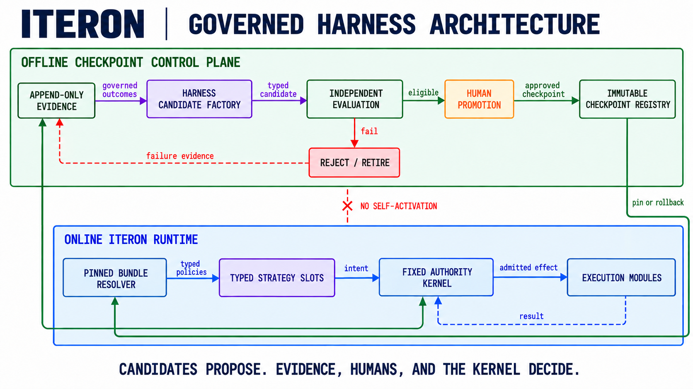

# Architecture

## Two diagrams, two questions

The checkpoint surface answers **which admitted harness should this model-task
cell use?**

The runtime architecture answers **how can that checkpoint reach execution
without acquiring authority?**

Both diagrams are target contracts, not shipped-conformance claims.

## Target boundary

The diagram is a target contract, not a shipped-conformance claim. Iteron
aims to evolve versioned harness and world-module candidates while keeping
authority, hard budgets, effect mediation, durable evidence, and promotion
control outside the learnable surface.

Iteron is intended to have two separated paths joined by a content-pinned
registry: an offline evidence and promotion path, and an online serving path.

### Fixed runtime TCB

The trusted computing base owns versioned protocol and correlation, deterministic
state reduction, canonical record/checkpoint/replay, identity and trust,
capability admission, budgets/deadlines/cancellation, the single effect broker,
plugin lifecycle, and the exact policy bundle pinned to a run.

It does not read files or environment variables, call providers, build prompts,
select context, spawn processes, parse MCP, render UI, or train and activate a
policy directly.

### Replaceable strategy and world modules

Provider routing, planning, context, memory, tools, scheduling, verification,
orchestration, extensions, UI, and domain-specific world adapters live outside
the TCB. They return bounded proposals and receive capability-scoped results; they
do not receive ambient authority.

### Evolution control plane

A future isolated control plane may produce immutable **harness** candidates.
SFT, preference, GRPO, and RL names are producer-provenance labels for harness
artifacts only; the base model remains frozen.
Promotion follows trajectory to governed dataset to candidate to held-out
evaluation to shadow to canary to active, with deterministic rollback.

Safety policy, permissions, durability, evidence integrity, budgets, data consent,
and promotion authority remain human-controlled and cannot be optimized away.
Model adapters and weights are reserved manifest vocabulary and fail validation;
trajectory projection has no model-training export target.

### Checkpoint selector

The target selector receives a measured model profile, a characterized task
profile, and an explicit objective with fixed constraints. It resolves an
already admitted checkpoint from the registry and pins that identity before the
run begins. Runtime outcomes return to the offline evidence path; they never
rewrite the live policy in place.

This turns the logical Cartesian product into an operational mapping without
requiring one configuration file for every task instance. A checkpoint may cover
an applicability region only when sensitivity and outcome evidence support that
transfer. Unsupported cells fall back to a pinned baseline.

## Current implementation truth

The workspace is divided into protocol, record, observability, provider, tools,
sandbox, context, verification, MCP, scheduling, agents, kernel, CLI, evaluation,
and evolution-contract crates. This is useful modularity, but the kernel still
depends on concrete implementations and the CLI/TUI still participates in runtime
composition. Iteron therefore does not yet claim microkernel conformance.

The runtime also does not yet ship a first-class `TaskProfile`, checkpoint
applicability index, or serving-time checkpoint selector. Existing
`PolicyManifest` and `PolicyBundle` contracts provide typed identity, frozen
model identity, evaluation-suite digests, lineage, admission, and rollback for a
checkpoint candidate. They do not prove that the full model-task mapping has
been solved.

This current modular monolith is nevertheless divided into machine-checked human
development boundaries. The boundary registry guarantees unique path
responsibility and detects internal Cargo dependency drift; invariant overlays
identify changes that need cross-cutting review. This collaboration contract does
not imply runtime isolation or microkernel conformance.

The extraction path is:

1. versioned canonical command/event envelopes;
2. a pure state reducer producing action requests;
3. one capability and effect broker;
4. injected provider, world, context, verification, and scheduler ports;
5. a long-lived session runtime with bounded flow control;
6. a versioned App Server used by the CLI/TUI and future clients.
