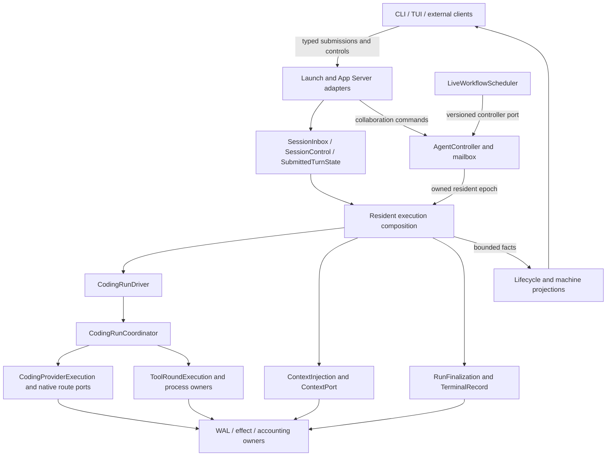
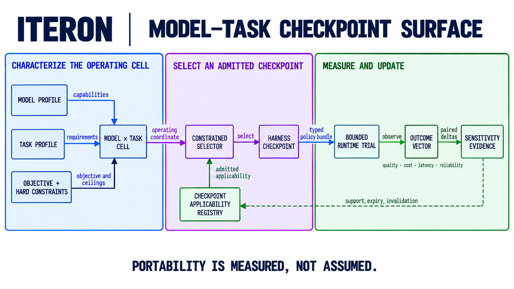
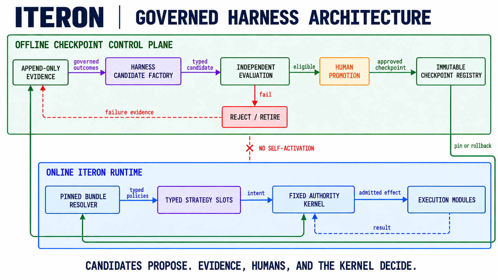

# Architecture

## Ordinary coding runtime

The ordinary product has one resident `Agent` execution path. CLI launch adapters and the
App Server session host submit work to that path; terminal rendering and socket observers
do not own another model/tool loop. The runtime imports shared command/event contracts and
the pure machine projection, with no production dependency on TUI, App Server or CLI output.
This direction is checked by `iteron-xtask boundaries check`.

The following diagram names logical interfaces in the current source. Each arrow carries
a command, a narrow execution port or an immutable observation; it does not grant access to
another owner's mutable state.

```mermaid
flowchart TD
    Front[CLI / TUI / external clients] -->|typed submissions and controls| Host[Launch and App Server adapters]
    Host --> Ingress[SessionInbox / SessionControl / SubmittedTurnState]
    Ingress --> Resident[Resident execution composition]
    Resident --> Driver[CodingRunDriver]
    Driver --> Coordinator[CodingRunCoordinator]
    Resident --> Context[ContextInjection and ContextPort]
    Coordinator --> Provider[CodingProviderExecution and native route ports]
    Coordinator --> Tools[ToolRoundExecution and process owners]
    Resident --> Terminal[RunFinalization and TerminalRecord]
    Host -->|collaboration commands| Controller[AgentController and mailbox]
    Scheduler[LiveWorkflowScheduler] -->|versioned controller port| Controller
    Controller -->|owned resident epoch| Resident
    Context --> Journal[WAL / effect / accounting owners]
    Provider --> Journal
    Tools --> Journal
    Terminal --> Journal
    Resident -->|bounded facts| Projection[Lifecycle and machine projections]
    Projection --> Front
```

The table names current source ownership. An extracted file is useful only when its state,
physical work or decision authority belongs to that owner; file size alone is not acceptance.

| Responsibility | Actual owner or interface | Input and output |
| --- | --- | --- |
| Resident ingress and controls | `runtime/session_inbox.rs`, `session_control.rs`, `submitted_turn_state.rs` | Identified submissions, product epoch, bounded pending steer and control observations. |
| Request preparation | `runtime/request_preparation.rs`, `request_context_evidence.rs` | Admitted context and frozen tool/route inputs; prepared request or a bounded compaction candidate. |
| Physical provider admission | `runtime/provider_dispatch.rs`, `provider_attempt_journal.rs` | Actual governor and financial admission; matching intent and logical start before transport; mailbox confirmation uses actual retained native input. |
| Provider execution and settlement | `runtime/provider_execution_scope.rs`, `provider_round.rs`, `provider_followup.rs`, `provider_attempt_pump.rs` | One actual stream/declaration lifetime; settled physical receipts, bounded retries and explicit fallback. |
| Tool admission and execution | `runtime/stream_tool_admission.rs`, `ordered_tool_call.rs`, `deferred_tool_batch.rs`, `early_tool_collection.rs` | Frozen operation permissions and actual effect intent; ordered known or unknown tool results. |
| Captured provider directory | `providers/directory.rs`, `instance_factory.rs`, `selection_identity.rs` | Exact operator routes and current catalog/health facts; validated selection and pure identity. |
| Provider caches | `providers/catalog_cache.rs`, `probe_cache.rs`, `cache_storage.rs`, `cache_writeback.rs` | Private scoped retained evidence and consumed best-effort writeback; no secret byte projection. |
| Prepared mailbox input | `runtime/persistent_agents/prepared_mailbox.rs`, `request_manifest.rs` | Full native user-text fields and private host commitments; retained manifest before durable consumption before IO. |
| Resident transcript | `runtime/session_transcript.rs` | Private restored/working projection; actual durable new-input receipt before consuming staged state. |
| Coding invocation phases | `runtime/coding_run_driver.rs`, `coding_run_coordinator.rs`, `coding_response_phase.rs` | Retained transcript and provider/tool obligations; private consumed IO handoffs and actual response completion. |
| Stable context installation | `runtime/context_injection.rs`, `context_injection_journal.rs` | Historical or live bounded source; required durable prefix receipt before installing cached bytes. |
| Versioned captured pixels | `protocol/image_record.rs`, `runtime/tool_image_replay.rs` | New pixel vocabulary uses versioned message/compaction tags; actual current replay retains verified image provenance and order. |
| Model response | `runtime/model_response.rs` | Provider stop reason and existing invocation state; continuation, answer candidate, bounded stop or refusal. |
| Terminal and publication | `runtime/control_terminal.rs`, `run_finalization.rs`, `terminal_record.rs`, `turn_publication.rs` | Actual cleanup and committed terminal receipts; read-only answer/finalization facts. |
| Persistent collaboration | `crates/agents`, `runtime/persistent_agents`, `workflow/live_session` | Host-bound identities, bounded mailbox and controller budgets; exact task/attempt receipts. |
| Client transport | `app_server/session_host.rs`, `tui/headless/connection.rs`, protocol client commands | Authenticated run-scoped commands and bounded observation subscriptions. |
| Shared presentation | `machine_projection.rs`, `machine_projection/` | Immutable runtime/protocol facts to the canonical machine schema; no provider, terminal or socket authority. |
| TUI interaction | `tui/input_lanes.rs`, `completion_owner.rs`, `picker_owner.rs`, `attachment_owner.rs`, `session_navigation.rs` | Private editor/picker state and unique physical workers; immutable render views and typed submissions. |
| Ordinary extension SDK | `crates/extension-sdk`, `runtime/ordinary_extensions.rs` | Inert descriptors, host-bound native tools/routes, text status and read-only lifecycle ports. |

An ordinary assistant response completes through the normal answer/terminal path. There is
no default completion verifier, two-human approval or high-assurance profile. The existing
`--verify` command is an explicit operator choice. Ticket investigation and script workflows
are separate optional compile features, disabled in the default build. Browser and native
desktop tools require explicit operator installation; neither starts a driver by registration.

Private session, provider, tool, journal and presentation state have distinct owners. Consumers
read bounded projections or carry narrow temporary ports; they do not receive a mutable Agent
as an extension callback. Durable publication, execution authority and observation delivery
have different receipts: losing an observer cannot reverse a committed physical terminal.

The ongoing runtime and TUI extraction is not yet a completed architecture acceptance claim.
Rebuild the source inventory with `iteron-xtask architecture inventory`; current-candidate
compiler, client/render, recovery, platform and performance evidence must accompany completion.

## Optional checkpoint and evolution contracts

The diagrams below describe the optional checkpoint and offline evolution system. The
ordinary coding path above remains the product entry point. These target contracts do not
add a research, work-order or promotion stage to an ordinary turn.

The checkpoint surface answers **which admitted harness should this model-task
cell use?**

The runtime architecture answers **how can that checkpoint reach execution
without acquiring authority?**

Both diagrams are target contracts, not shipped-conformance claims.

## Target boundary

The diagram is a target contract, not a shipped-conformance claim. Iteron
aims to evolve versioned harness and world-module candidates while keeping
authority, hard budgets, effect mediation, durable evidence, and promotion
control outside the learnable surface.

Iteron is intended to have two separated paths joined by a content-pinned
registry: an offline evidence and promotion path, and an online serving path.

### Fixed runtime TCB

The trusted computing base owns versioned protocol and correlation, deterministic
state reduction, canonical record/checkpoint/replay, identity and trust,
capability admission, budgets/deadlines/cancellation, the single effect broker,
plugin lifecycle, and the exact policy bundle pinned to a run.

It does not read files or environment variables, call providers, build prompts,
select context, spawn processes, parse MCP, render UI, or train and activate a
policy directly.

### Replaceable strategy and world modules

Provider routing, planning, context, memory, tools, scheduling, verification,
orchestration, extensions, UI, and domain-specific world adapters live outside
the TCB. They return bounded proposals and receive capability-scoped results; they
do not receive ambient authority.

### Evolution control plane

A future isolated control plane may produce immutable **harness** candidates.
SFT, preference, GRPO, and RL names are producer-provenance labels for harness
artifacts only; the base model remains frozen.
Promotion follows trajectory to governed dataset to candidate to held-out
evaluation to shadow to canary to active, with deterministic rollback.

Safety policy, permissions, durability, evidence integrity, budgets, data consent,
and promotion authority remain human-controlled and cannot be optimized away.
Model adapters and weights are reserved manifest vocabulary and fail validation;
trajectory projection has no model-training export target.

### Checkpoint selector

The target selector receives a measured model profile, a characterized task
profile, and an explicit objective with fixed constraints. It resolves an
already admitted checkpoint from the registry and pins that identity before the
run begins. Runtime outcomes return to the offline evidence path; they never
rewrite the live policy in place.

This turns the logical Cartesian product into an operational mapping without
requiring one configuration file for every task instance. A checkpoint may cover
an applicability region only when sensitivity and outcome evidence support that
transfer. Unsupported cells fall back to a pinned baseline.

## Current implementation truth

The workspace is divided into protocol, record, observability, provider, tools,
sandbox, context, verification, MCP, scheduling, agents, kernel, CLI, evaluation,
and evolution-contract crates. This is useful modularity, but the kernel still
depends on concrete implementations and the CLI/TUI still participates in runtime
composition. Iteron therefore does not yet claim microkernel conformance.

The runtime also does not yet ship a first-class `TaskProfile`, checkpoint
applicability index, or serving-time checkpoint selector. Existing
`PolicyManifest` and `PolicyBundle` contracts provide typed identity, frozen
model identity, evaluation-suite digests, lineage, admission, and rollback for a
checkpoint candidate. They do not prove that the full model-task mapping has
been solved.

This current modular monolith is nevertheless divided into machine-checked human
development boundaries. The boundary registry guarantees unique path
responsibility and detects internal Cargo dependency drift; invariant overlays
identify changes that need cross-cutting review. This collaboration contract does
not imply runtime isolation or microkernel conformance.

The extraction path is:

1. versioned canonical command/event envelopes;
2. a pure state reducer producing action requests;
3. one capability and effect broker;
4. injected provider, world, context, verification, and scheduler ports;
5. a long-lived session runtime with bounded flow control;
6. a versioned App Server used by the CLI/TUI and future clients.
