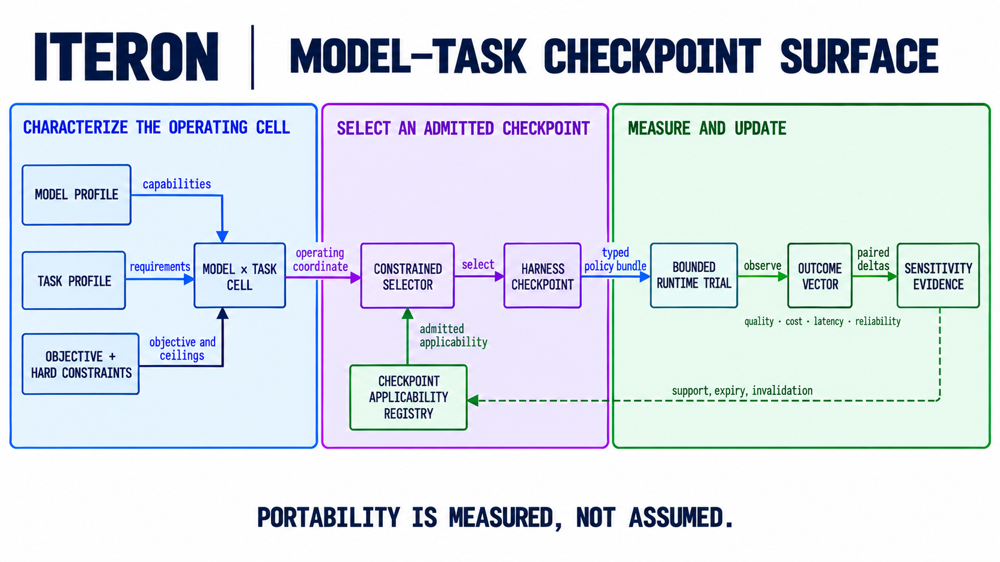

# Why harness checkpoints

An agent is the product of a model, a task, and the harness that connects them.
Changing the model while holding the harness fixed can move the useful operating
point. Changing the task while holding the model fixed can do the same. This is
why a global default configuration is a baseline, not a final answer.

Iteron's goal is to make that interaction explicit and turn the selected harness
state into a first-class artifact: a **harness checkpoint**.



## Three coupled coordinate systems

The problem starts with three vectors. Their exact dimensions may evolve, but
their roles must remain distinct.

| Coordinate | Describes | Example dimensions |
| --- | --- | --- |
| **Model profile** `M(m)` | Capabilities and operating characteristics of a frozen model route | context window and degradation, reasoning controls, tool-call fidelity, structured-output support, latency, cost, and failure modes |
| **Task profile** `T(t)` | Requirements and constraints of a task or task distribution | reasoning depth, repository breadth, tool and effect needs, interaction horizon, oracle strength, ambiguity, failure cost, and latency budget |
| **Harness profile** `H(h)` | Decisions made around the model | context selection, prompts, tool exposure, planning, routing, scheduling, collaboration, retries, budgets, verification, and recovery |

`TaskProfile` denotes a characterized task class or distribution. It must not
encode the answer to an individual evaluation item. That distinction makes the
mapping useful in deployment and prevents per-item configuration from becoming
a disguised benchmark shortcut.

The model profile is measured at the route boundary rather than inferred only
from a vendor name. For example, a reasoning-effort setting is **inert** when a
route does not implement that control. Inert is different from low sensitivity:
the former is outside that model's effective search space, while the latter is a
valid choice whose measured effect is small.

Harness controls also have different granularities:

| Level | Unit of change | Example |
| --- | --- | --- |
| **Parameter** | A value within one policy implementation | compaction trigger, retry count, verifier timeout |
| **Policy** | The behavior bound to one typed strategy slot | context selector, tool policy, scheduler, verifier |
| **Bundle** | A compatible selection of policies across slots | the complete harness profile pinned for a run |

Sensitivity can therefore be measured as a parameter perturbation, a policy or
implementation swap, or a bundle-level interaction. The evidence must record
which level changed; otherwise an observed gain cannot be attributed to the
decision that caused it.

## Current implementation surface

The checked-in registries separate the values Iteron can address today from
structural facts and fixed host invariants. This is the current machine-readable
surface:

| Layer | Current surface |
| --- | ---: |
| Harness families | **160** total; **119** profile-addressable |
| Parameter rows | **2,238** total: **586** searchable, **872** bounded, and **780** structural |
| Applied parameter rows | **1,458** searchable or bounded values |
| Replaceable modules | **28** independent optimization identities |
| Model-visible text | **10** prompt artifacts and **27** tool descriptions |
| Runtime candidate addresses | **2,084**: 1,435 unified-profile, 323 direct-config, and 326 caller-input |
| Fixed boundary | **887** read-only invariant rows pending owning-human review |

The census is complete for the production source forms it declares. It is not a
mathematical inventory of every value future code could generate, and it does
not prove that the model-task mapping has been solved. A first-class
`TaskProfile`, applicability index, and checkpoint selector remain target
architecture.

## Outcomes are a vector

For a frozen model `m`, task profile `t`, and admitted harness profile `h`, define
the observed result as:

```text
Y(m, t, h) = [quality, cost, latency, reliability]
```

The components stay separate. A checkpoint that is faster but less reliable is
not silently declared better by hiding both changes inside one reward. Security,
authority, evidence integrity, and hard resource ceilings remain constraints
outside the objective vector; an optimizer cannot trade them for quality.

A deployment may choose among the admissible Pareto frontier using its stated
budget or service objective. The choice and the full outcome vector belong in
the checkpoint evidence so another operator can interpret the result without
guessing which trade-off produced it.

## Sensitivity connects the three systems

For a harness coordinate `h_i`, Iteron is interested in the conditional response:

```text
S_i(m, t) = ΔY(m, t, h) / Δh_i
```

This is normally estimated with bounded perturbations or paired alternatives,
not assumed to be a smooth derivative. It asks a concrete question: **for this
model and this task profile, which harness decision moves which outcome, and by
how much?**

The answer can vary across the operating surface:

- a larger context allocation may help a model with strong long-context recall
  on repository-wide tasks, while adding cost and distraction elsewhere;
- more repair attempts may help a weaker model converge on a task with a strong
  executable oracle, while wasting budget when feedback is ambiguous;
- a smaller tool surface may improve tool selection for one model, while hiding
  a necessary capability for another task;
- full verification may be justified for broad, high-cost changes, while an
  impacted-test strategy may dominate for a local edit.

This sensitivity map is the bridge between multi-dimensional task evaluation,
multi-dimensional model evaluation, and harness policy. It tells a selector
which coordinates matter in each region and prevents search budget from being
spent on controls that are inert there.

## The model-task operating surface

The logical target is a selection function over the Cartesian product:

```text
checkpoint* : ModelProfile × TaskProfile → HarnessCheckpoint
```

For each cell, the selected checkpoint is an admissible point on the harness
policy surface. It is conditioned on an explicit objective and fixed constraints:

```text
checkpoint*(m, t | objective, constraints)
    = select Pareto-admissible h from H for Y(m, t, h)
```

The Cartesian product describes the semantics, not a requirement to maintain one
file for every task instance. Operationally, a checkpoint may cover an
**applicability region** containing model-task profiles with equivalent measured
responses. The region can be split when sensitivity or outcome evidence diverges.
An unseen or weakly supported cell falls back to a pinned baseline instead of
receiving an invented optimum.

Transfer is therefore a measured operation. Moving a checkpoint to a different
model profile or task region creates a new evaluation claim; it does not inherit
the source cell's evidence automatically.

## What a checkpoint must bind

A deployable harness checkpoint is more than a configuration bag. Its identity
needs to bind:

1. the frozen model route and model capability profile;
2. the task profile, evaluation-suite identity, and applicability region;
3. one typed policy per selected harness slot, including parameter values and
   implementation identities;
4. the objective, hard constraints, and evaluation protocol;
5. the observed outcome vector, uncertainty, and sensitivity evidence used for
   selection;
6. content digests, lineage, provenance, admission result, and rollback target.

Iteron's existing `PolicyManifest` and `PolicyBundle` contracts establish the
typed policy identity, frozen base-model identity, evaluation-suite digest,
lineage, admission, and rollback parts of this shape. A first-class task-profile
schema, applicability index, and runtime checkpoint selector remain target
architecture. Until those exist, a manifest is an inspectable checkpoint
candidate, but it is not proof that the model-task mapping has been solved.

## Selector boundary

The intended data flow has a serving path and an offline evidence path:

```text
frozen model route ──→ model profile ──┐
                                      ├─→ checkpoint selector ─→ pinned checkpoint
task envelope ───────→ task profile ──┘                            │
                                                                  ▼
                                                      fixed kernel + runtime
                                                                  │
                                                                  ▼
trajectory + outcome vector ←──────────────────────────────────── run
            │
            ▼
offline sensitivity and candidate estimation
            │
            ▼
admission + independent evaluation + human promotion
            │
            └──────────────────────────────→ checkpoint catalog
```

The selector does not grant authority and does not modify the model. It resolves
an already admitted checkpoint from typed model and task profiles. The runtime
pins that identity before work begins, and the resulting evidence returns to the
offline path rather than changing the live policy in place.

This boundary makes harness composition **choosable**. A component system can
describe which policies can be assembled; the checkpoint system records which
admitted assembly should be used for a characterized model-task cell, why it was
selected, and where that claim stops applying.

## The next architecture contracts

Four small contracts complete the concept:

| Contract | Required behavior |
| --- | --- |
| `ModelProfile` | Versioned, measured capability and route characteristics; unsupported controls are marked inert. |
| `TaskProfile` | Versioned requirements and constraints derived from `TaskEnvelope`, with no per-item answer features. |
| `SensitivityEvidence` | Binds a bounded policy perturbation to the exact model profile, task profile, baseline checkpoint, and outcome-vector delta. |
| `CheckpointApplicability` | Maps a checkpoint to a supported model-task region, evidence strength, fallback, expiry, and invalidation conditions. |

Together these contracts let Iteron state its purpose precisely: characterize
the model, characterize the task, measure how harness decisions interact with
both, and resolve a governed checkpoint for the corresponding point on the
model-task operating surface.
