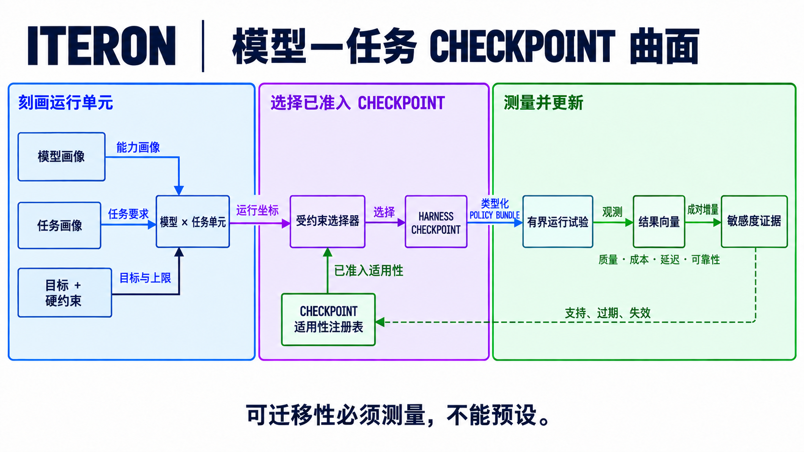

# 为什么需要 Harness checkpoint

[English](harness-checkpoints.md)

一个 Agent 是模型、任务以及连接二者的 harness 共同作用的产物。保持 harness
不变而更换模型，可能改变真正有效的运行点；保持模型不变而更换任务，也会产生同样
的变化。因此，全局默认配置只能作为基线，不能作为最终答案。

Iteron 的目标是把这种相互作用显式化，并把选定的 harness 状态变成一等制品：
**harness checkpoint**。



## 三个相互耦合的坐标系

问题从三个向量开始。它们的具体维度可以演进，但三者的职责必须保持分离。

| 坐标 | 描述对象 | 维度示例 |
| --- | --- | --- |
| **模型画像** `M(m)` | 冻结模型路由的能力与运行特征 | 上下文窗口及退化曲线、推理控制、工具调用可靠性、结构化输出支持、延迟、成本与失败模式 |
| **任务画像** `T(t)` | 某一任务或任务分布的要求与约束 | 推理深度、仓库范围、工具与副作用需求、交互时长、判定器强度、歧义、失败成本与延迟预算 |
| **Harness 画像** `H(h)` | 围绕模型做出的决策 | 上下文选择、prompt、工具暴露、规划、路由、调度、协作、重试、预算、验证与恢复 |

`TaskProfile` 表示已经刻画的任务类别或任务分布，不能编码某个评测样本的答案。
只有保持这一区分，映射才能用于真实部署，也能防止逐题配置退化成伪装的 benchmark
捷径。

模型画像在路由边界上测量，不能只从供应商名称推断。例如，当某条路由没有实现
reasoning-effort 控制时，该参数是**惰性的（inert）**。惰性不同于低敏感度：前者
不属于该模型的有效搜索空间，后者则是一个效果经测量后较小、但仍然有效的选择。

Harness 控制项也具有不同粒度：

| 层级 | 变化单元 | 示例 |
| --- | --- | --- |
| **参数** | 某个 policy 实现内部的一个值 | 压缩触发点、重试次数、验证器超时 |
| **Policy** | 绑定到一个类型化策略槽位的行为 | 上下文选择器、工具策略、调度器、验证器 |
| **Bundle** | 跨槽位且彼此兼容的一组 policy | 为一次运行固定的完整 harness 画像 |

因此，敏感度可以来自参数扰动、policy 或实现替换，也可以来自 bundle 层面的交互。
证据必须记录变化发生在哪一层；否则，观测到的增益无法归因到真正产生它的决策。

## 当前实现表面

仓库内的注册表把 Iteron 当前能够寻址的值、结构事实和固定 host 不变量分开记录。
当前机器可读的表面如下：

| 层级 | 当前表面 |
| --- | ---: |
| Harness family | 共 **160** 个，其中 **119** 个可由 profile 寻址 |
| 参数行 | 共 **2,238** 行：**586** 个 searchable、**872** 个 bounded、**780** 个 structural |
| 已应用参数行 | **1,458** 个 searchable 或 bounded 值 |
| 可替换模块 | **28** 个独立优化身份 |
| 模型可见文本 | **10** 个 prompt 制品与 **27** 个工具描述 |
| Runtime candidate 地址 | **2,084** 个：1,435 个 unified-profile、323 个 direct-config、326 个 caller-input |
| 固定边界 | **887** 个只读不变量行，等待负责人复核 |

这份普查完整覆盖了其声明的生产源码形式，但它不是未来代码可能生成的每一个值的
数学全集，也不能证明模型—任务映射已经求解。一等 `TaskProfile`、适用性索引和
checkpoint 选择器仍属于目标架构。

## 结果是一个向量

对于冻结模型 `m`、任务画像 `t` 和准入后的 harness 画像 `h`，把观测结果定义为：

```text
Y(m, t, h) = [quality, cost, latency, reliability]
```

这些分量始终保持独立。一个更快但可靠性更低的 checkpoint，不能通过把两项变化
藏进单一 reward 而被悄然宣布为更优。安全、权限、证据完整性和硬资源上限是目标
向量之外的约束，优化器不能用它们换取质量。

部署方可以依据明确的预算或服务目标，从允许的 Pareto 前沿中选择。选择依据和完整
结果向量都必须写入 checkpoint 证据，使其他操作者不必猜测结果来自哪一种权衡。

## 敏感度连接三个系统

对于 harness 坐标 `h_i`，Iteron 关心以下条件响应：

```text
S_i(m, t) = ΔY(m, t, h) / Δh_i
```

它通常通过有界扰动或成对候选估计，并不假设存在平滑导数。它回答一个具体问题：
**对于这个模型和这类任务，哪一项 harness 决策会改变哪一项结果，幅度多大？**

答案会随运行表面而变化：

- 更大的上下文配额可能帮助长上下文召回能力强的模型完成全仓库任务，也可能在其他
  区域只增加成本和干扰；
- 更多修复尝试可能帮助较弱模型在拥有强可执行判定器的任务上收敛，也可能在反馈含糊
  时浪费预算；
- 更小的工具表面可能提升某个模型的工具选择能力，也可能隐藏另一类任务所必需的能力；
- 对范围广、失败成本高的变更，完整验证可能合理；对局部编辑，受影响测试策略可能
  更占优势。

这张敏感度地图连接了多维任务评估、多维模型评估与 harness policy。它告诉选择器
每个区域里哪些坐标真正重要，也避免把搜索预算浪费在该区域内的惰性控制项上。

## 模型—任务运行表面

逻辑目标是在笛卡尔积上定义一个选择函数：

```text
checkpoint* : ModelProfile × TaskProfile → HarnessCheckpoint
```

对于每个单元格，选中的 checkpoint 都是 harness policy 表面上的一个允许点，并受
明确目标和固定约束共同限定：

```text
checkpoint*(m, t | objective, constraints)
    = select Pareto-admissible h from H for Y(m, t, h)
```

笛卡尔积描述的是语义，并不要求每个任务实例各维护一个文件。在实际运行中，一个
checkpoint 可以覆盖由模型—任务画像组成的**适用区域**，前提是这些画像具有等价的
实测响应。当敏感度或结果证据发生分歧时，该区域可以继续拆分。对于未见过或证据薄弱
的单元格，系统回退到固定基线，而不会虚构一个最优解。

因此，迁移必须经过测量。把 checkpoint 搬到不同的模型画像或任务区域，会产生新的
评估主张；它不会自动继承来源单元格的证据。

## 一个 checkpoint 必须绑定什么

可部署的 harness checkpoint 不只是一袋配置。它的身份需要绑定：

1. 冻结的模型路由和模型能力画像；
2. 任务画像、评测套件身份和适用区域；
3. 每个已选 harness 槽位中的一个类型化 policy，包括参数值和实现身份；
4. 目标、硬约束和评估协议；
5. 用于选择的观测结果向量、不确定性和敏感度证据；
6. 内容摘要、谱系、来源、准入结果和回滚目标。

Iteron 现有的 `PolicyManifest` 与 `PolicyBundle` 契约已经建立了类型化 policy 身份、
冻结基础模型身份、评测套件摘要、谱系、准入与回滚结构。一等任务画像 schema、适用性
索引和 runtime checkpoint 选择器仍属于目标架构。在这些能力落地前，一个 manifest
是可检查的 checkpoint 候选，但不能证明模型—任务映射已经求解。

## 选择器边界

预期的数据流包含在线服务路径和离线证据路径：

```text
冻结模型路由 ──→ 模型画像 ──┐
                             ├─→ checkpoint 选择器 ─→ 固定 checkpoint
任务 envelope ──→ 任务画像 ──┘                              │
                                                           ▼
                                                固定内核 + runtime
                                                           │
                                                           ▼
trajectory + 结果向量 ←────────────────────────────────── 一次运行
          │
          ▼
离线敏感度与候选估计
          │
          ▼
准入 + 独立评估 + 人工晋升
          │
          └──────────────────────────────────→ checkpoint 目录
```

选择器不授予权限，也不修改模型。它只根据类型化的模型画像和任务画像，解析一个已经
准入的 checkpoint。Runtime 在工作开始前固定该身份；产生的证据回到离线路径，不会
在运行中就地修改在线 policy。

这条边界让 harness 组合成为**可选择对象**。组件系统可以描述哪些 policy 能够组装；
checkpoint 系统则记录：对于一个已经刻画的模型—任务单元格，应使用哪一个准入组合、
为什么选择它，以及这项主张在哪里停止适用。

## 下一步架构契约

四个小型契约可以补全这一概念：

| 契约 | 必需行为 |
| --- | --- |
| `ModelProfile` | 记录版本化、实测的能力与路由特征；不支持的控制项标记为惰性。 |
| `TaskProfile` | 从 `TaskEnvelope` 派生版本化要求与约束，不包含逐题答案特征。 |
| `SensitivityEvidence` | 把一次有界 policy 扰动绑定到精确的模型画像、任务画像、基线 checkpoint 和结果向量变化。 |
| `CheckpointApplicability` | 把 checkpoint 映射到受支持的模型—任务区域、证据强度、回退项、过期时间和失效条件。 |

这些契约共同让 Iteron 能够准确表达自己的目标：刻画模型，刻画任务，测量 harness
决策与二者的相互作用，并为模型—任务运行表面上的对应点解析一个受治理的 checkpoint。
