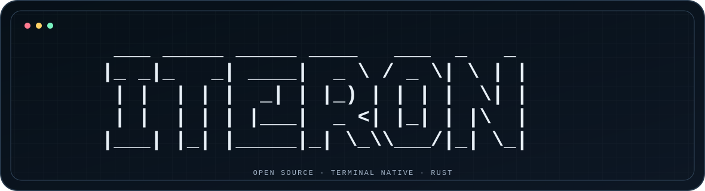

  

# Iteron

Iteron is an open-source, terminal-native coding agent and a modular Rust
substrate for bounded, recoverable, and observable agent runtimes.

Created and led by [Jamal Cao
(@fr0m-scratch)](https://github.com/fr0m-scratch), Creator and Project Lead.

!!! warning "Pre-alpha software"
    Iteron is useful for development and evaluation, but it is not
    production-ready. Do not run it unattended against sensitive repositories,
    and do not treat its sandbox as a confidentiality boundary.

## What works today

-   :material-console: **Terminal-first operation**

    ---

    An interactive TUI plus one-shot text, JSON, and JSONL output for scripts.

-   :material-connection: **Multiple provider adapters**

    ---

    Anthropic Messages, OpenAI Responses, and OpenAI-compatible Chat adapters,
    with built-in profiles for six providers.

-   :material-shield-lock-outline: **Explicit authority**

    ---

    Capability-based permission modes, bounded runs, scoped effects, and
    macOS/Linux sandbox backends.

-   :material-history: **Durable sessions**

    ---

    Hash-chained local records with continuation, resume, and fork operations.

Iteron can read, search, and edit a workspace; run explicitly authorized
commands; work with Git, memory, skills, hooks, and initial MCP tooling; and run a
verification command before accepting completion.

## Start here

1. [Install or build Iteron](getting-started/installation.md).
2. Run the [setup and BYOK guide](getting-started/setup-and-byok.md) to validate
   and store a provider key outside the repository.
3. Follow the [quickstart](getting-started/quickstart.md) in a disposable test
   repository.
4. Review [permissions and sandbox limitations](using/permissions-and-sandbox.md)
   before allowing code execution.

## Current architecture truth

The workspace is split into protocol, record, observability, provider, tools,
sandbox, context, verification, MCP, scheduling, agent-policy, kernel, CLI,
evaluation, and evolution-contract crates. That is useful source modularity, but
the runtime is still a **modular monolith**: concrete composition remains in the
kernel and CLI/TUI.

A pure reducer, one effect broker, injected capability ports, a stable App Server,
complete process supervision, full MCP/LSP lifecycle support, trustworthy cost
accounting, and governed strategy evolution are target work. See the
[architecture](architecture.md) and [roadmap](roadmap.md); neither page turns a
target contract into a shipped feature.

## Project links

- [GitHub repository](https://github.com/Plantcore-AI/Iteron)
- [Project status](project/status.md)
- [Roadmap](roadmap.md)
- [Contributing](project/contributing.md)
- [Security](project/security.md)
- [Support](project/support.md)
