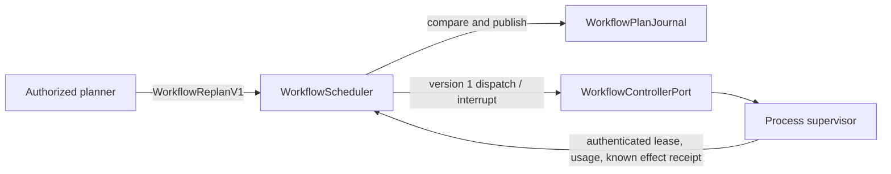

# Live workflow scheduler v1

The `iteron-workflow::live_scheduler` module owns plan revisions, dependency readiness,
attempt attribution and graph reservations. The agent controller owns persistent identity,
turns, context, permissions and mailbox delivery. The process supervisor owns execution and
cleanup. The scheduler has no mutable access to either owner's internal state.

## Plan and execution contract

- A request uses a bounded identifier and expected plan revision. The same identifier and exact
  command replay the original receipt; a changed command conflicts. State sequence and plan
  revision are separate, so a completion does not invalidate an otherwise current plan revision.
- One plan transaction may add nodes, replace pending nodes, remove pending nodes, or explicitly
  retry definitely failed/cancelled nodes. The complete candidate graph must fit node, edge,
  depth and budget limits and contain no cycles or dangling references before publication.
- Successful nodes are immutable. Removing work retains its identifier as a tombstone; a planner
  cannot evade lifetime node capacity by deleting and recreating the same work.
- Dispatch durably records intent and reserves a bounded attempt before invoking the controller.
  The controller must bind the exact workflow, node, attempt and input envelope to an admitted
  existing agent. A busy or unauthorized agent is a definite refusal, not a successful dispatch.
- A cancellation acknowledgement records `cancelling`. It does not prove cleanup. Actual
  supervisor settlement is required before explicit retry or reassignment. Old attempt/lease
  outputs cannot settle a later attempt.
- Restart changes dispatching/running/cancelling nodes to `recovery_required` before observation.
  Unknown effects quarantine new dispatch for the graph until actual controller and supervisor
  evidence reconciles them. There is no automatic external-effect replay.
- Reservations are monotonic across retries. Cumulative per-attempt usage receipts avoid double
  charging when an unknown outcome is reconciled. Budget overruns remain visible and stop work.
- The host supplies clock observations. Graph and attempt absolute deadlines persist across
  restart; `expired_nodes` identifies running work whose cancellation must be enforced by the
  host. The controller admission port is bounded to five seconds.

## Storage adapter

`WorkflowFileJournal` pins a pre-provisioned private application directory on Unix, rejects
symlinks, hard links, foreign owners and group/world access, and holds an exclusive writer lease.
It publishes a bounded, digest-checked snapshot through write, file sync, atomic rename and
directory sync. A durable genesis marker prevents a lost snapshot from being treated as new work.
An ambiguous commit poisons the live owner until reopening and reconciliation.

The directory is a host trust boundary and must not be an untrusted workspace path. SHA-256 is
an accidental corruption check, not authentication against an actor who owns the state directory.
This adapter does not claim durable namespace support on Windows. A different journal adapter
can implement the same typed contract without changing scheduler state rules.

## Evidence and integration status

`crates/workflow/tests/live_scheduler.rs` exercises live A → B/C → D planning, revision and
request conflicts, cycles, active/finished mutation refusal, explicit cancellation/reassignment,
late epochs, restart quarantine, cumulative usage, unknown dispatch/publication, host deadlines,
single-agent concurrency and lifetime reservations. `live_scheduler_file.rs` exercises actual
private file publication/reopen, single-writer leases, lost/corrupt state and namespace attacks.

These tests establish scheduler and journal contracts. Product CLI/TUI/API dispatch through a
real persistent controller, real provider/process cancellation and cross-platform durability are
separate integration evidence; this module alone does not establish those journeys.
