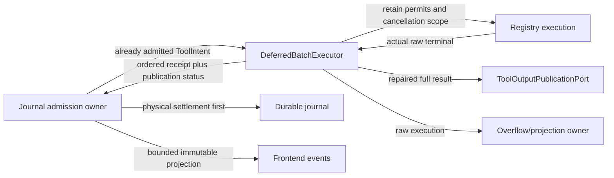

# Runtime owner and port map

This map describes the maintained source boundaries. An immutable event or receipt conveys
observation; it does not grant permission or acquire mutable ownership of another domain.

| Source | Owner/responsibility | Directional interface |
| --- | --- | --- |
| `runtime.rs` / `Agent` | Session composition and current journal/provider turn coordinator | Owns durable admission/settlement; calls execution and projection ports |
| `runtime/deferred_batch_executor.rs` | Physical futures, governor permits and cancellation scope for an already-admitted batch | Accepts `ToolIntent`, immutable registry/governor/cancellation ports; returns declaration-ordered `DeferredToolReceipt` |
| `runtime/artifact_publication.rs` | Trusted full-output publication adapter | `ToolOutputPublicationPort` receives repaired raw `ToolResult` and actual effect-known flag before spill/truncation |
| `runtime/tool_output_spill.rs` | Private raw overflow leases and bounded model-visible projection | Managed results retain explicit spill ownership; cleanup follows actual settlement |
| `runtime/tool_presentation.rs` | Pure bounded/redacted UI and approval-evidence projection | Immutable `ToolUse`/`ToolResult` → frontend values; no journal/process state |
| `runtime/stream_progress.rs` | Sole output/thinking counters and emission cadence | Observes stream deltas, emits bounded latest progress through `try_send` |
| `runtime/early_tool_gate.rs` | Bounded operator-configured hook predispatch coordinator | Immutable gate context → typed complete-allow summary or refusal; no provider/Agent borrow |
| `runtime/kernel_effect_bridge.rs` | Single non-registry kernel broker adapter | Typed descriptor plus disjoint journal/admission ports → observed/unknown outcome; executor never gets mutable Agent |
| `runtime/submitted_turn_state.rs` | Single invocation-local error/recovery/continuation owner | Private counters and immutable recovered receipts; typed context/candidate continuation mutations, no Agent/provider/journal access |
| `runtime/provider_turn_evidence.rs` | Single logical provider-turn observation owner | Header/semantic token evidence, timing, quota and bounded text/thinking prefixes; no dispatch or budget authority |
| `runtime/frontend_events.rs` | Immutable frontend/control-resolution vocabulary | Explicit public type re-exports preserve existing runtime API |
| `runtime/persistent_agents.rs` | Actual resident execution host | Controller command/completion ports; runtime returns physical typed terminal/usage proof |
| `workflow/live_session/registry.rs` | Durable graph admission and retained scheduler instances | Owns registry CAS/reservations; invokes scheduler commands and proof coordinator |
| `workflow/live_session/pump.rs` | Stateless bounded graph/controller coordinator | Exact persisted task/epoch/terminal evidence → scheduler settlement |
| `workflow/live_session/store.rs` | Private registry filesystem/CAS adapter | Pinned namespace → bounded byte publication; no mutable agent state |
| `crates/workflow/src/live_scheduler/owner.rs` | Sole graph/revision/attempt owner | Directional controller and journal ports |
| `crates/agents/src/controller.rs` | Sole durable identity/mailbox/epoch owner | Domain commands and immutable views; no scheduler/provider dependency |

A batch opens every effect intent before dispatch. Its physical executor cannot manufacture
admission, mutate the journal or widen the inherited authority. Execution results repair the
structural tool-use ID before publication. Full-output publication precedes spill/model-visible
truncation. Publication failure travels separately from physical effect truth; the caller settles
known execution first, then reports unavailable retention. It must not turn a failed artifact write
into an unknown tool execution or automatically replay the tool.

These modules are independent owners/adapters with explicit imports, not `Agent` implementation
text fragments. Their size/import guards and source inventory run through the maintained xtask.
The remaining `Agent` field aggregate and provider/ordered effect coordinator are unfinished
architecture work; these extractions alone do not close the giant-runtime requirement. Final
acceptance needs the integrated default/optional profiles and actual concurrent tool, cancellation,
raw-artifact, frontend and restart journeys.
