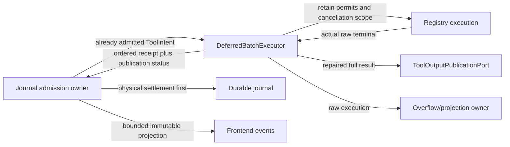

# Runtime owner and port map

This map describes the maintained source boundaries. An immutable event or receipt conveys
observation; it does not grant permission or acquire mutable ownership of another domain.

| Source | Owner/responsibility | Directional interface |
| --- | --- | --- |
| `providers/directory.rs` | Whole captured provider directory, private entries/health/deferred state | Exact current evidence → validated selection/build; frozen client snapshot cannot start discovery |
| `providers/catalog_cache.rs` / `probe_cache.rs` | Independent private retained catalog/account evidence | Validated scoped candidates → bounded reuse/update; catalog visibility alone never proves account health |
| `providers/cache_storage.rs` / `cache_writeback.rs` | Scope secret/private atomic namespace and consumed discovery writeback | Stores receive credential-bound digests; raw key bytes have no public/serde/debug surface |
| `providers/instance_factory.rs` / `selection_identity.rs` | Immutable exact route construction and pure captured identity | Trusted operator configuration/capability evidence → explicit instance/catalog or digest, without network or writer authority |
| `runtime/persistent_agents/prepared_mailbox.rs` | Same-mailbox sealed prepared native input inclusion | Exact host commitments and full native user-role fields → retained manifest → durable Consumed before IO; no claim of remote processing |
| `runtime.rs` / `Agent` | Session composition and current journal/provider turn coordinator | Owns durable admission/settlement; calls execution and projection ports |
| `runtime/tool_turn.rs` | Single mutable tool declaration/routing/failure/task-retention owner | Validated declaration → typed index and immutable policy draft; owned early/deferred/replayed work released once to physical settlement phase |
| `runtime/tool_round_driver.rs` | Completed-response tool phase and execution queue owner | Privately retained real early handles/window → settled early phase → one stored concurrent prefix → exact ordered active declaration → complete same response owner; cancelled/failed waits cannot rearm a stage |
| `runtime/tool_response.rs` | Single declaration-ordered tool-result and model-message envelope owner | Actual settled/replayed results and retained image projections → exact complete response set before recovery/optional verification; holes, substitutions and duplicate ordered results refuse without erasing physical terminal truth |
| `runtime/stream_tool_admission.rs` | Actual streamed declaration admission coordinator | ToolTurnOwner plus concrete policy/journal/ledger ports and frozen trusted scope → durable policy/hook/tool/source receipts before an owned captured executor task |
| `runtime/stream_tool_journal.rs` | Physical streamed decision, intent and source barriers | Actual PolicyEvidenceRecorder/EffectJournalOwner/Rollout/Ledger borrows; no execution or permission-grant port |
| `runtime/stream_tools.rs` | Pure operation-specific overlap eligibility | Registered operation effects plus real immutable operator/task/manifest ceilings and cancellation/deadline observations → optional early capability; read deny cannot bypass through Pure metadata |
| `runtime/stream_tool_events.rs` | Immutable shared tool frontend/lifecycle projection | Actual shared bounded frontend/emitter ports; observes declaration/admission/terminal/process/projection evidence, preserves queue saturation lifecycle and never creates a process |
| `runtime/early_tool_collection.rs` | Actual early task join/abort/reap and ordered settlement owner | Owned real handles plus absolute deadline → typed hook/tool terminal truth; result leases retained until post observers complete; cancellation never invents physical certainty |
| `runtime/tool_execution_journal.rs` | Physical registry intent/known/refused terminal adapter | Concrete EffectJournalOwner/Rollout/Ledger/cache/diagnostic/fault ports; append before live accounting and immutable tool projection |
| `runtime/early_tool_executor.rs` | Physical streamed task, fair execution lock and governor permit owner | Already-admitted call plus immutable execution/hook/cancellation/publication scope → owned task and actual receipt; drop revokes task without claiming physical effect truth |
| `runtime/deferred_tools.rs` | Pure leading batch selection | Actual registry metadata, immutable operation ceilings and bounded failed-action view → auto-authorized non-conflicting leading declarations; stops at a prompt/denial/repeat/unknown write set |
| `runtime/tool_declaration_admission.rs` | Actual ordered declaration policy/hook/approval admission owner | Registered exact proposal + current operation ceilings → real hook/approval and control barriers → permitted proposal or actual refused ToolDone; no executor or Agent authority |
| `runtime/control_ingress.rs` | Actual bounded SQ receipt journal/presenter | Existing inbox/control/seam owners → canonical rejection/stop/applied evidence; same ingress adapter at ordinary safe points and per-tool barriers |
| `runtime/permission_transaction.rs` | Actual remembered permission write-ahead transaction | Same enforced mode/rules + exact journal receipt → same live provenance handle, before approval resolution; no task or manifest widening |
| `runtime/kernel_tool_call.rs` | Actual intercepted kernel tool ticket/output lifetime | Already gated host call → real tool intent/source → observed raw host result → full publication → optional bounded spill → one known terminal/ledger fold → cleanup → ToolEnd; no child/plan/workflow execution authority |
| `runtime/kernel_tool_assembly.rs` | Concrete intercepted call wiring | Same host journal/publication/spill/projection/events ports; preserves inline bounded plan/artifact acknowledgements and managed child/workflow output behavior |
| `runtime/ordered_tool_call.rs` | One actual ordered registry effect and observer lifetime owner | Already-permitted ToolIntent → actual WAL intent → captured registry future → physical terminal/receipt → bounded spill cleanup and post hook; frozen cancellation/events/publication ports, no Agent proxy |
| `runtime/optional_tool_round.rs` | Optional completed-round classifications and candidate evidence | Explicit ticket strategy or existing `--verify` → tracked proposals/paths → actual result settlement; ordinary coding returns no tracker before registry scans; no tool permission, execution or added completion gate |
| `queue_policy.rs` | Shared bounded frontend queue contract | Pinned SQ/EQ policy → runtime configuration and frontend wiring; the runtime does not import its App Server adapter |
| `runtime/deferred_batch_admission.rs` | Actual control/hook group predispatch owner | Same Inbox/control/WAL ports → configured hook terminal → fresh control/deadline safe point → physical batch admission; refused allowed tail stays with ordered owner |
| `runtime/deferred_batch_assembly.rs` | Concrete batch composition only | Real immutable operation policy and disjoint journal/control/hook/executor borrows; no dispatch or state transitions in the factory |
| `runtime/deferred_tool_batch.rs` | Actual admitted batch coordinator and ticket/result lifetime owner | Concrete journal/ledger/cache + frozen registry/hook/cancel/publication/projection ports; all intents before execution, physical settlement before publication status, all post observers before ToolEnd |
| `runtime/deferred_batch_executor.rs` | Physical futures, governor permits and cancellation scope for an already-admitted batch | Accepts `ToolIntent`, immutable registry/governor/cancellation ports; returns declaration-ordered `DeferredToolReceipt` |
| `runtime/artifact_publication.rs` | Trusted full-output publication adapter | `ToolOutputPublicationPort` receives repaired raw `ToolResult` and actual effect-known flag before spill/truncation |
| `runtime/tool_output_spill.rs` | Private raw overflow leases and bounded model-visible projection | Managed results retain explicit spill ownership; cleanup follows actual settlement |
| `runtime/tool_presentation.rs` | Pure bounded/redacted UI and approval-evidence projection | Immutable `ToolUse`/`ToolResult` → frontend values; no journal/process state |
| `runtime/stream_progress.rs` | Sole output/thinking counters and emission cadence | Observes stream deltas, emits bounded latest progress through `try_send` |
| `runtime/hook_execution.rs` | Actual configured hook dispatch and ticket settlement coordinator | Concrete Hooks/command journal/cancellation/activity plus EffectJournalOwner/Rollout/Ledger ports; pretool denials return typed calls for durable ToolDone, actual tools are terminal before post observers start |
| `runtime/early_tool_gate.rs` | Bounded operator-configured hook predispatch coordinator | Immutable gate context → typed complete-allow summary or refusal; no provider/Agent borrow |
| `runtime/kernel_effect_bridge.rs` | Single non-registry kernel broker adapter | Typed descriptor plus disjoint journal/admission ports → observed/unknown outcome; executor never gets mutable Agent |
| `runtime/effect_descriptor.rs` | Pure effect identity, audit and terminal vocabulary | Immutable typed descriptor → bounded scrubbed audit values; no owner/writer/executor dependency |
| `runtime/effect_journal_owner.rs` | Single actual effect identity, unknown, recovery and workspace mutation owner | Disjoint Rollout/Ledger ports → durable open/settle/broker receipts; canonical WAL folded once per adoption; bounded parent settlement observation distinguishes unknown physical effects from operator admission policy |
| `runtime/session_control.rs` | Single actual cooperative control latch and inherited signal owner | Priority-preserving request/read/terminal-clear operations and bounded retry wait; provider refusal works without a deadline or installed atomic |
| `runtime/session_inbox.rs` | Single actual SQ receiver, product epoch and bounded pending-steer owner | Bounded FIFO consume → exact stale/control/overflow receipts; physical append failure restores the identical steer ahead of its tail, no manufactured Applied receipt |
| `runtime/session_transcript.rs` | Single resident restored/finished transcript and intake owner | Actual message WAL/publication receipt before consuming restored state; returned working state is moved only after successful followup advance, cold adoption still requires verified history |
| `runtime/submitted_turn_state.rs` | Single invocation-local error/recovery/continuation owner | Private counters and immutable recovered receipts; typed context/candidate continuation mutations, no Agent/provider/journal access |
| `runtime/model_response.rs` | Actual no-tool stop/continuation/completion interpreter | Existing SubmittedTurnState and optional convergence owner → typed bounded continuation, refusal, candidate or budget terminal; steering, configured verifier and durable Done remain host barriers |
| `runtime/request_preparation.rs` | Single actual undispatched content/estimate/recovery candidate owner | Real estimator and source-separated accounting → bounded summary decision → actual confirmed compaction seed receipt → candidate installation → validated physical-cap request; route controls captured at final safe point, no Agent/provider IO |
| `runtime/request_recovery_driver.rs` | Actual finite emergency-recovery coordinator and retained preparation candidate | One consumed gate/summary/control/coverage/assessment work item at a time; same estimator and actual synced compaction receipt before transcript replacement; no Agent/provider callback |
| `runtime/compaction_journal.rs` | Sole compaction submission/closed/cooldown state and actual seed publication | Concrete Rollout/ledger/publication/diagnostic ports → confirmed seed receipt → lifetime state/trace fold; append refusal retains the original transcript |
| `runtime/compaction_assembly.rs` | Immutable current compaction profile and disjoint port wiring | Exact resident system/catalog/window/output context plus real writer/estimator/state owners; no execution or recovery policy in the factory |
| `runtime/context_preparation_events.rs` | Frozen context lifecycle projection | Actual scope and physical-boundary turn identities → bounded lifecycle emitter/observer; no effect or gating authority |
| `runtime/request_accounting.rs` | Request source partition and conservative calibrated estimate adapter | Actual immutable source evidence, attachment witnesses, existing shared calibration and fixed component policy → baseline/calibrated input admission; no invented provider usage or mutable session authority |
| `runtime/provider_turn_driver.rs` | Actual executable route/stream/followup composition owner | Privately owns real route/round/execution/refusal; exact hedge transfer → native capture/pump → host inclusion safe point → physical terminal → bounded followup → durable selection/card → fresh intent; no Agent proxy |
| `runtime/provider_turn_assembly.rs` | Composition-only disjoint port factories | Authenticated resident fields → concrete driver execution/journal/selection/environment ports; contains no dispatch, retry, control wait or settlement policy |
| `runtime/provider_route_binding.rs` | Actual pre-attested selection and pricing transaction | Same sole selection/card owner plus real policy/ModelSelected writers → resident provider/model swap; governor rollback only for an uncommitted newly registered route |
| `runtime/provider_financial_source.rs` | Immutable authenticated finance owner handles | Actual tenant/run/attribution and existing USD/controller ports → fresh current selected-card/native usage-bound snapshot per physical admission; no new monetary counter |
| `provider_funding_assembly.rs` | Quote a new auxiliary request from actual signed current/candidate financial evidence, then transfer that same physical request through existing admission; never re-quote an active reservation | FinancialSource/FinancialContext → native cap normalizer → original dispatch guard |
| `runtime/provider_response_recovery.rs` | Actual closed-round semantic recovery and prefix retention owner | Real closed physical result + same submitted counters/control/USD/early task journals → finite continuation or cleaned physical/contract failure; keeps exact complete declarations and observed prefix, never relabels billing |
| `runtime/provider_response_assembly.rs` | Disjoint response and existing early-task port factory | Same ToolExecutionJournal/HookExecutionScope/frontends/publication/source slots; no new execution or state owner |
| `runtime/provider_round.rs` | Single response/declaration and pending physical pump owner for a model round | Actual stream → physical settlement → governor observation/permit release → typed route decision → admitted followup or close; exact streamed/returned tool projection, no Agent/monetary authority or recreated ticket |
| `runtime/provider_stream_observer.rs` | Actual stream item presentation and activity span owner | Frozen frontend/lifecycle/activity ports plus StreamItem → typed tool/quota/notice disposition; never provider dispatch, journal admission or budget authority |
| `runtime/request_context_evidence.rs` | Single bounded materialized/recorded context source state and request evidence builder | Immutable actual effective system/messages/tools/images and estimator scope → content-free ledger; precise length-framed schema commitments, governing trust floor, explicit dropped source evidence |
| `runtime/provider_stream_attempt.rs` | Actual physical provider stream pump | Exact normal/refused/hedged transport receipt → concrete observation/tool admission ports; no mutable Agent or financial authority |
| `crates/provider/src/request_capture.rs` | Exact physical body observation port | Bounded serialize once → same HTTP body; host observer barriers before send, local intent is distinct from remote acceptance; no auth headers or raw endpoint exports |
| `runtime/advisory_maintenance/` | Independent advisory cache writer and journal | Two physical workers and bounded jobs/bytes; actual queued/running/terminal barriers; pinned ancestor handles and pending target witness persist before cache IO; readonly same owner observes actual revision |
| `runtime/provider_transport_attempt.rs` | Actual admitted transport controls and cancellation | Frozen provider/control/deadline/stop ports → one physical transport future; retries, durable intent and money remain separate owners |
| `runtime/provider_charge_evidence.rs` | Exact physical charge ledger and signed tenant/run/turn/attempt receipt evidence | Bounded actual WAL replay and logical-winner dedup; no mutable session/provider/transport access |
| `runtime/provider_financial_context.rs` | Frozen authenticated pricing/scope plus existing monetary/controller ports | Signed physical cap/usage proof → actual reservation/CAS settlement; same real owners, no new monetary ledger |
| `runtime/provider_dispatch.rs` | Actual initial/retry admission coordinator | Same Plantcore gate + financial/effect/logical-start barriers; actual mailbox consumption awaits native prepared inclusion, preserves sealed tickets and recovered identities |
| `runtime/provider_execution_scope.rs` | One round's actual execution governor, ordered gate and queued-read resources | Short-lived registry/permission/recovery evidence plus same journal ports → actual stream pump → physical terminal → same governor observation → permit release; context exposure remains between execution and terminal |
| `runtime/provider_followup.rs` | Actual settled retry wait and fallback preparation lifetime | Existing round/route owners + actual money/control/governor observations → finite wait/re-admission or validated physical-cap fallback proposal; selection and fresh intent remain separate durable barriers |
| `runtime/provider_attempt_journal.rs` | Actual provider physical WAL/financial boundary adapter | Signed finite pre-bound → intent sync → controller reserve; actual terminal sync → controller settlement; failed terminal retains/quarantines bound |
| `runtime/provider_attempt_pump.rs` | Private actual physical execution/terminal phase state | Real native stream + streamed tool admission → host prepared inclusion observation → exact effect/controller/PlantCore/USD settlement; no Agent borrow |
| `runtime/provider_route_admission.rs` | Actual same-governor permit queue and outcome adapter | Queue activity + bounded real control wait → actual lease; physical quota/circuit truth → closed observation writer; no transport |
| `runtime/provider_route_journal.rs` | Closed durable quota/circuit Notice adapter | Actual governor transition/quota → same Rollout/fault/latency port; cannot select models or emit provider/turn effects |
| `runtime/provider_selection.rs` | Sole executable route epoch, exact provider object and authenticated price binding | Closed real selection barrier → live swap; opaque verified unpriced recovery; public fields checked as proposals |
| `runtime/provider_selection_journal.rs` | Closed ModelSelected/RateCardBound durable writer | Actual Rollout/fault/latency/diagnostic ports; no intent, transport or financial ownership |
| `runtime/provider_route_turn.rs` | Single actual logical request/provider/route/retry/ticket/permit/active-clock owner | Shared recovered physical identity enters once; settled attempt truth → bounded typed retry/fallback/terminal; normalized candidate capability/context check before durable selection |
| `runtime/provider_route_events.rs` | Immutable lifecycle/activity adapter and actual retry wait | Concrete control/deadline/Ledger ports → cancellation or completed wait evidence; never route, journal or monetary authority |
| `runtime/provider_output_request.rs` | Actual adapter-attested physical output bound projection | Real ProviderOutputBudget proof → normalized exact request plus original incoming cap; missing proof under hard authority refuses before intent/IO, no JSON token guesses |
| `runtime/provider_turn_evidence.rs` | Single logical provider-turn observation owner | Header/semantic token evidence, timing, quota and bounded text/thinking prefixes; no dispatch or budget authority |
| `runtime/terminal_record.rs` | Single mutable turn cost/counter/verifier evidence owner and durable terminal adapter | Actual recorder/rollout/ledger ports → policy terminal and one-barrier Idle/Done receipt; physical append failure never reports success |
| `runtime/workspace_checkpoint.rs` | Single confirmed checkpoint state and snapshot coordinator | Frozen workspace/runtime scope plus actual journal/effect/ledger ports; mandatory intent before physical copy, exact Checkpoint source and known effect terminal before publishing rollback state; adoption clears the old scope |
| `runtime/turn_publication.rs` | Single retained record-sourced answer/finalization projection | Constructor/adoption performs verified scoped recovery once; actual committed Message/Answer/Done receipts update the bounded owner; completion/query reads at most256 facts with no IO; frontend observers grant no authority |
| `runtime/frontend_events.rs` | Immutable frontend/control-resolution vocabulary | Explicit public type re-exports preserve existing runtime API |
| `runtime/persistent_agents.rs` | Actual resident execution host | Controller command/completion ports; runtime returns physical typed terminal/usage proof |
| `workflow/live_session/registry.rs` | Durable graph admission and retained scheduler instances | Owns registry CAS/reservations; invokes scheduler commands and proof coordinator |
| `workflow/live_session/pump.rs` | Stateless bounded graph/controller coordinator | Exact persisted task/epoch/terminal evidence → scheduler settlement |
| `workflow/live_session/store.rs` | Private registry filesystem/CAS adapter | Pinned namespace → bounded byte publication; no mutable agent state |
| `crates/workflow/src/live_scheduler/owner.rs` | Sole graph/revision/attempt owner | Directional controller and journal ports |
| `crates/agents/src/controller.rs` | Sole durable identity/mailbox/epoch owner | Domain commands and immutable views; no scheduler/provider dependency |
| `memory_request_exposure.rs` | Private bounded scheduled/activated/used/unused memory transitions, exact native prepared-factory proof and existing trace/lifecycle fold | Authentic request factory → private visibility owner → trace observer |
| `request_admission.rs` | Own the actual final preparation through non-rearmable validation, executable context gate and actual control safe point, then consume it into one native request | RequestPreparation → phase journal + actual hook/control receipt → admitted request |
| `request_admission_journal.rs` | Buffer the real model phase and account existing kernel tokens with fault/fsync/diagnostic and bounded UI evidence | Actual Rollout/Ledger → accepted phase projection |
| `request_context_publication.rs` | Publish actual post-gate request source ledger and original bounded lifecycle evidence | Read-only source/estimator evidence → existing ContextLedgerStore/events |
| `request_admission_assembly.rs` | Compose disjoint real writer and immutable current scope/configuration ports | Agent composition → concrete domain ports |
| `execution_deadline.rs` | Privately retain finite live invocation/ancestor deadline leases, expose their actual minimum and retire released bounds | Trusted parent/child scope → exact live deadline snapshot |
| `submission_invocation.rs` | Retain the actual encrypted image graph lease and invocation deadline through all physical work, release own clock before post-answer maintenance | Actual run/tenant/turn → private attachment graph + owned deadline |
| `orchestration_lifetime.rs` | Own actual explicitly requested orchestration liveness; future/error drop cannot leak the old topology flag | Explicit invocation → non-cloneable live lease |
| `provider_extension.rs` | Optional project-neutral dispatch/observation ports and opaque real lease; absent adapter has no state/allocation/call | Installed trusted adapter → actual lease/terminal observation |
| `provider_extension_assembly.rs` | Compose no adapter in standalone builds and capture an owned optional gate only from installed feature authority | Trusted composition → optional borrowed extension / immutable owned gate |
| `legacy_provider_extension.rs` | Compile-only historical adapter; preserve actual permit Drop and physical observation without product types in provider owners | Explicit feature → project-neutral port |
| `steering_admission.rs` | Consume the actual bounded inbox only after low-trust evidence and the Message receipt commit; preserve exact pending sources on a refused writer | Host-resolved source → real transcript journal → exact client receipt |
| `completion_session.rs` | Compose concrete record/control/steering ports and, only for existing explicit verification, the actual gate ports | Transcript + control safe point → existing optional verification |
| `turn_completion.rs` | Consume one actual model or declaration-complete tool response through steering, guidance and completion decisions | Model decision / tool response → typed action → independent host terminal |
| `completion_assembly.rs`, `steering_assembly.rs` | Capture disjoint actual scope/state/writer ports; no Agent retained by a domain | Trusted composition → one consumed completion lifetime |
| `tool_round_execution.rs` | Own the complete finite early/batch/ordered phase and the exact pending special call plus actual external lease; cancelled waits cannot rearm it | Real ToolRoundDriver → concrete execution session → typed kernel handoff → exact settled result |
| `tool_execution_session.rs` | Reborrow the same journal, permission, inbox, hooks and immutable authority through real collection and physical execution | Actual record/control/permission owners → existing physical admission/execution owners |
| `tool_execution_assembly.rs` | Capture current trusted tool scope and optional real dispatch gate at each phase entry | Agent composition → concrete disjoint execution ports |
| `bundle_adapter/checkpoint.rs` | Own the actual immutable nine-slot objects, BootBundle, compiler receipt and runtime identities as one generation; Agent and KernelSpawnerContext retain one Arc | Complete compiler admission/adoption → borrowed strategy ports and shared child generation |
| `provider_response_commit.rs` | Retain one accepted physical response and USD obligation through usage, existing observer barrier, actual context reconciliation and assistant Message commit | Accepted physical response → exact logical usage journal → SDK/frontend event → confirmed transcript |
| `provider_usage_journal.rs` | Publish only the authenticated sealed physical projection with its exact usage; physical money is never charged again | Physical usage receipt → typed committed journal → logical token/cost ledger |
| `context_usage_reconciliation.rs` | Replace only the matching bounded context slot and consume its exact calibration baseline using authoritative usage | Actual native usage → existing context/calibration owner |
| `request_cycle.rs` | Keep the actual recovery candidate, requested policy, observation clock and loop state together; consume the recovery borrow before native admission | Confirmed recovery/control → current signed cap/turn → closed native request + exact loop guard |
| `request_cycle_assembly.rs` | Freeze actual system/tool projection and trusted current physical bounds; ordinary runs add no investigation state | Current provider/context/compiled policy evidence → request recipe |
| `provider_turn_entry.rs` | Transfer the actual admitted governor/USD obligations with immutable current execution scope to the model-turn owner | Native request + actual dispatch admission → ProviderTurnDriver seed |
| `kernel_special_execution.rs`, `kernel_special_assembly.rs` | Select only the actual pending special call and compose disjoint journal, control, plan and child execution ports | Exact tool-round handoff → actual native special execution → known terminal or physical uncertainty |
| `direct_child_execution.rs`, `workflow_execution.rs`, `workflow_preparation.rs` | Construct and run actual bounded native or controller children, retain cancellation and distinguish physical cleanup from accounting observation | Held native sources → actual children → terminal and owned ledger observation |
| `workflow_spawner/agent_route_binding.rs` | Select only an unambiguous held native provider object with actual identity, capabilities and existing governor route | Bounded model proposal → actual native provider and narrowed executable caps |
| `coding_run_driver.rs`, `coding_provider_execution.rs` | Retain private invocation messages, response/tool phases, provider obligation and exact pending kernel call | Real provider/tool execution ports → consumed completion decisions |
| `coding_request_execution.rs` | Retain the actual working transcript, recovery guard and admission state through host errors and a single request projection | Frozen recipe + owned transcript → concrete recovery/admission ports → native request |
| `invocation_admission.rs`, `invocation_admission_assembly.rs` | Recover actual policy and effects, finish bounded control, then retain operator media or leaf deadline before execution | Real journal/funding/control ports → one retained invocation lifetime |
| `invocation_funding.rs`, `invocation_funding_assembly.rs` | Commit monetary policy before installing shared funding and restore only actual signed physical charges | Actual scoped WAL → complete charge recovery → installed shared ceiling |
| `invocation_cleanup.rs` | Settle private tool and MCP content before publishing the parent outcome | Actual cleanup stores → outcome with observed cleanup errors |
| `persistent_writer_settlement.rs`, `workflow_spawner/writer_settlement.rs` | Derive physical writer settlement from real native workers, process observations, parent apply and workspace witness | Owned worktree transaction → known merge/discard or retained uncertainty |
| `agents/controller/epoch_settlement.rs` | Preserve physical completion independently of accounting completeness and retain incomplete reservations | Actual terminal observations → durable controller facts → combined scheduling admission |
| `kernel_child_accounting.rs`, `obs/child_accounting.rs` | Preserve known child/tool terminals before separately observing real ledgers; exact pending facts survive restart and prevent unproven finite-budget admission | Known physical completion → exact accounting WAL pair → actual ledger fold |
| `client_effects.rs`, `client_effects/`, `app_server/client_export.rs` | Retain native transcript publication, private content cleanup and actual session/read/concurrency leases outside frontend observers | Observed current run port → scoped host export → independent publication and cleanup receipts |

A batch opens every effect intent before dispatch. Its physical executor cannot manufacture
admission, mutate the journal or widen the inherited authority. Execution results repair the
structural tool-use ID before publication. Full-output publication precedes spill/model-visible
truncation. Publication failure travels separately from physical effect truth; the caller settles
known execution first, then reports unavailable retention. It must not turn a failed artifact write
into an unknown tool execution or automatically replay the tool.

These modules are independent owners/adapters with explicit imports, not `Agent` implementation
text fragments. Their size/import guards and source inventory run through the maintained xtask.
The remaining `Agent` field aggregate, request preparation and route/tool admission coordination
are unfinished architecture work; these extractions alone do not close the giant-runtime requirement. Final
acceptance needs the integrated default/optional profiles and actual concurrent tool, cancellation,
raw-artifact, frontend and restart journeys.

### Optional task plans

`TaskPlanOwner` owns a bounded model-maintained plan, its exact durable publication sequence, the latest admitted user-message sequence, and whether new input requires review. `update_plan` is a writer-only native tool: ordinary permission, hook and control admission precedes its local journal. `inspect` creates no plan; `replace` requires the current revision and submission sequence. A prepared replacement becomes visible only after its `TaskPlanUpdatedV1` fsync receipt. Resume and staged adoption fold verified current-run events once. An active plan and unresolved obligations enter the actual request before input-budget estimation; finished plans with no obligations add no context. Plan statuses describe model intent and do not grant capabilities or prove verification. Whole-loop/native frontend acceptance remains pending.

### Provider discovery admission

`providers/discovery.rs` owns dormant network work, the unique refresh task, first-paint admission, its activity phase and immutable settled entries. `ProviderDirectory` receives a typed settlement and delegates selected-provider construction. Private cache storage and retained cache/catalog values have separate owners. `client_inventory/catalog_host.rs` validates a discovery draft before installing a live executable directory; a rejected or abandoned draft retains the admitted directory, ends its actual pending state and exposes a bounded failure observation. Client snapshots cannot start discovery or mint route authority. The first-task gate consumes an actual successful first-frame receipt; failure leaves the task editable. Provider, native socket and first-frame fixtures are written; same-candidate execution remains pending.
